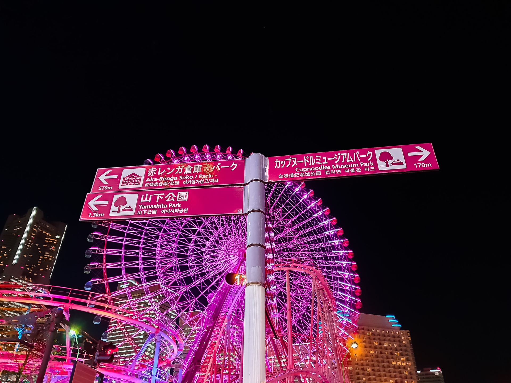
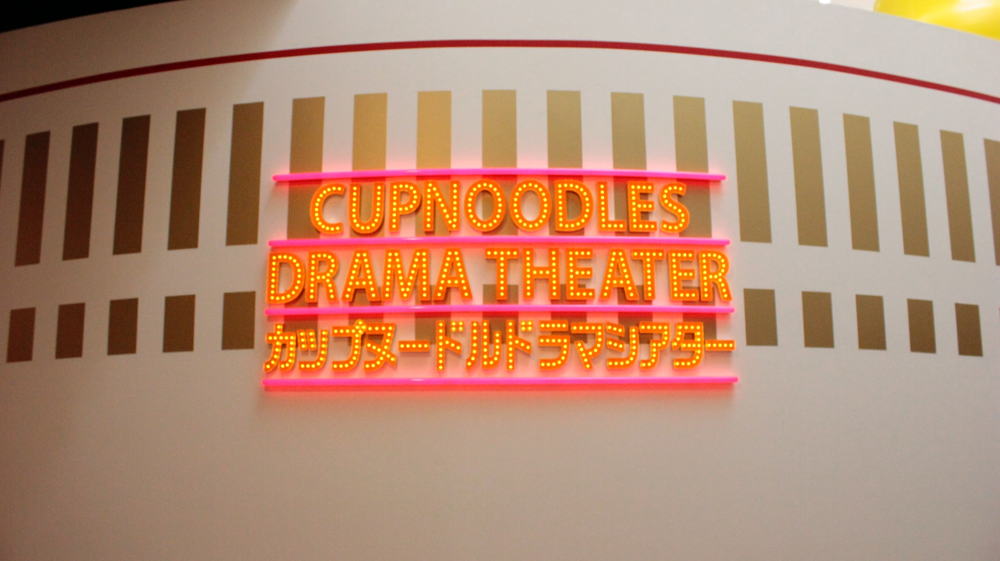
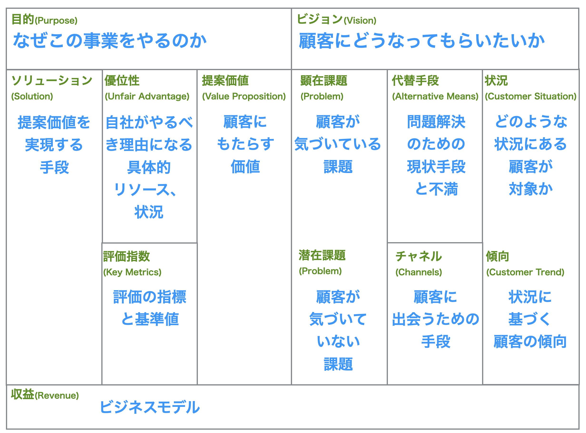
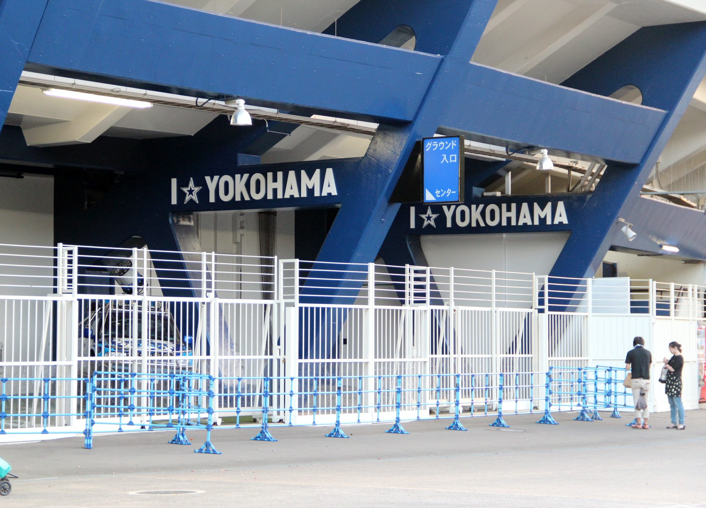
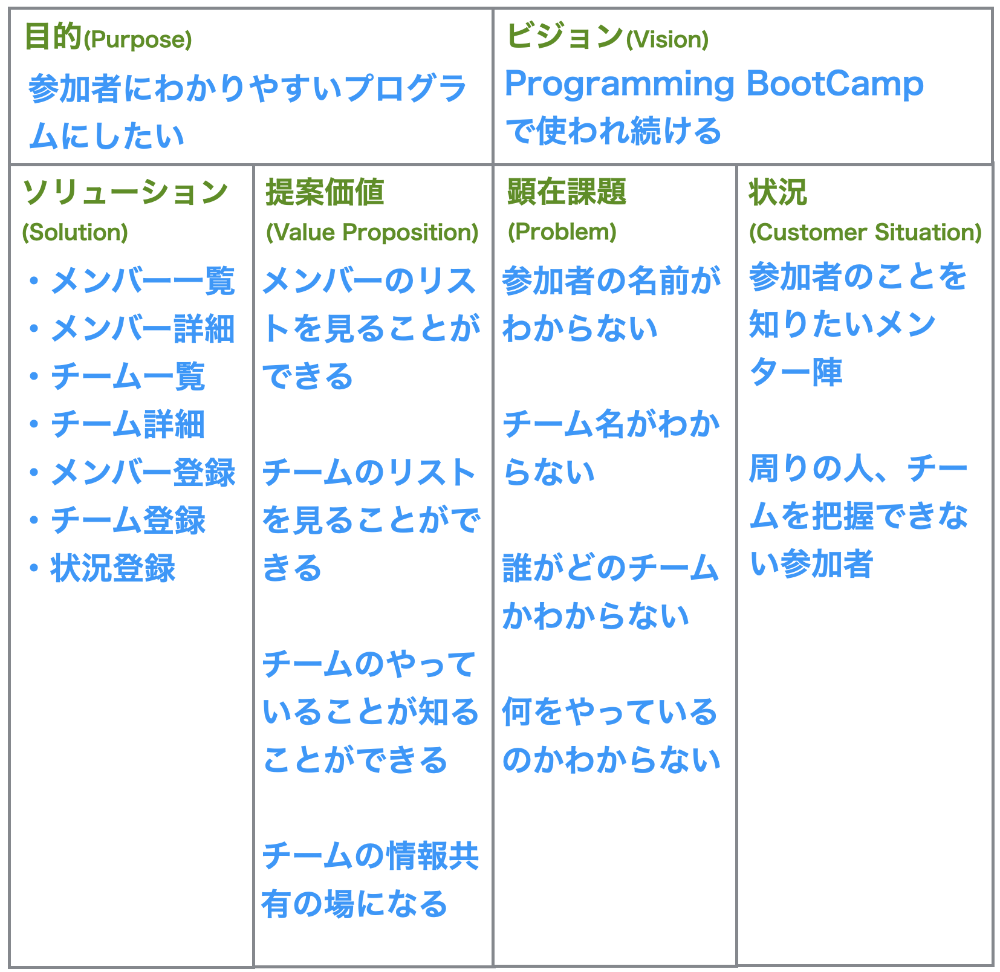
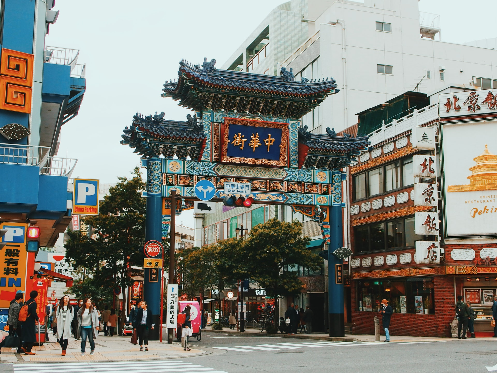

<!--
_color: white
_footer: 'Photo by Tunafish on Unsplash https://unsplash.com/@ultratunafish'
-->

**Programming Boot Camp Development Phase**

# 仮説キャンバスワーク(簡易版)

**Online Classes 2020/12/05**
　
　
　
　
　
　　　　　　　　　　　　　　　　　　　　　　　　**Junichiro Ueno**

---

### :christmas_tree: 本日のアジェンダ

:white_check_mark: 仮説キャンバスワーク(簡易版)

:white_check_mark: 13:00〜15:00 ストーリーマッピング

:white_check_mark: 15:00〜17:30 簡易画面スケッチ+UI検証

:white_check_mark: 17:30〜18:00 本日のふりかえり・合宿に向けて

---

<!--
_color: white
_footer: 'Photo by Rantau Backpacker on Unsplash https://unsplash.com/@rantau_backpacker91'
-->

**Programming Boot Camp Development Phase**

# 仮説キャンバスワーク(簡易版)

**Online Classes 2020/12/05**

---

## :christmas_tree: 目的
キャンバスに書いてみることで自分たちのやりたいことを可視化することで整理することができる

このあと自分たちがつくるサービスのイメージをわかりやすくしたり、検討してなかったことや課題を見つけることも目的のひとつ

---

<!--
_color: white
_footer: 'Photo by Hkyu Wu on Unsplash https://unsplash.com/@hkyu'
-->

<!-- _class: lead -->
# 仮説とは

---

### :snowman: 問題： どれが仮説でしょうか:question:

1. **男性がメイン写真を顔写真にしない 理由を知りたい**

1. **サブ写真の設定枚数がなぜ少ないのか 知りたい**

1. **久しぶりにログインしたユーザーに“自分の投稿の表示順位が上に来る“ようにすれば、使い続けてくれるのではないか?**

---

### :snowman: 正解： これが仮説です:exclamation:

1. **男性がメイン写真を顔写真にしない理由を知りたい**

### → 調査:scream:

1. **サブ写真の設定枚数がなぜ少ないのか知りたい**

### → 調査:dizzy_face:
1. **久しぶりにログインしたユーザーに“自分の投稿の表示順位が上に来る“ようにすれば、使い続けてくれるのではないか?**

### → 仮説:bulb:

---
## 仮説を整える
[**状況**] どんな状況のユーザーの
[**要望**] 満たしたい要望、解決したい問題は何
[**提案価値**] どんな状態にするのか
[**ソリューション**] どうやってやるか
[**(皆さんの)目的**] 何のために?
　　　　　　　　　　　　　　　　　　　　ワンライナーキャンバス

---

<!--
_color: white
_footer: 'Photo by Matt &amp; Chris Pua on Unsplash https://unsplash.com/@yo_puaaa'
-->

<!-- _class: lead -->
# 仮説キャンバス

---

## なぜやるのか

「このサービスは誰のどんなことにどうやって役に立つの？」(=コンセプト)を捉えた上で、チームメンバーや関係者とのコミュニケーションを促進するため

---

---

<!--
_color: white
_footer: 'Photo by Dave Kim on Unsplash https://unsplash.com/@dkim278'
-->

<!-- _class: lead -->
# 仮説キャンバスワーク(簡易版)

---

---

<!--
_color: white
_footer: 'Photo by Yu Kato on Unsplash https://unsplash.com/@yukato'
-->

<!-- _class: lead -->
# やってみよう

---

