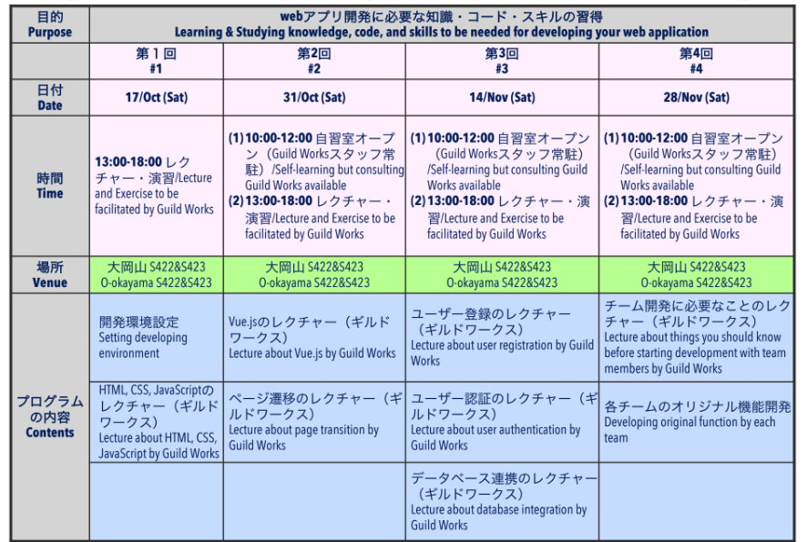
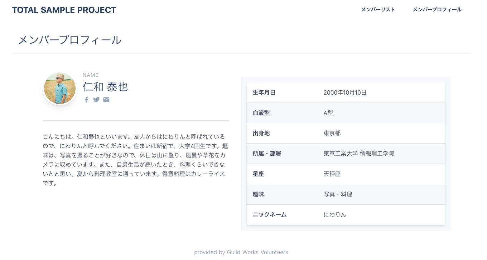

<!-- page_number: true -->
<!-- paginate: true -->

# はじめに

今日から4回にわたって行うLearning Phaseの
全体像を知っておきましょう。

---

---

# 第1回： Webの基本技術を使えるようになろう

あらゆるWebサービスで利用される
基本かつ必須の技術である３つの言語、
HTML, CSS, Javascriptの基礎を使えるようになりましょう。

---

# 今日の目標
- HTML, CSS, Javascriptの使い方を理解できている。
- HTML, CSSを使って、自分で画面を作れる。

---

こんな画面をつくります。

---

# 今日やること

1. 開発環境をセットアップしよう
2. HTMLで画面の文書を定義しよう
3. CSSで画面をレイアウトしよう
4. Javascriptで画面に動きをつけよう（さわりだけ）

---

# 進め方

講義と演習をセットで進めていきます。
実際に書いて動かしてみることで身につけていきましょう。

