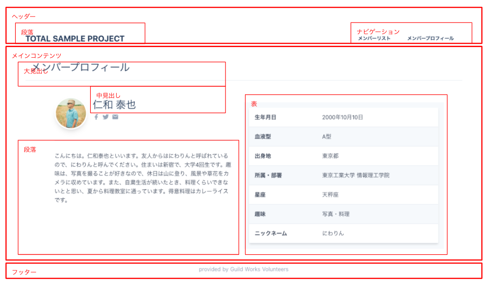
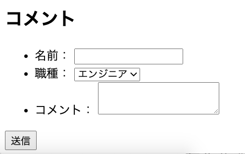

<!--  page_number: true -->
<!--  paginate: true -->

# 2. Let's define the document structure of the screen with HTML

---

## What is HTML?

Abbreviation for Hyper Text Markup Language.

Of a text document with embedded hyperlinks,
A language for defining structures (headings, paragraphs, etc.).

---

## How do you write it?

### Enclose it in tags to indicate its meaning.
```
<h1> Heading tag </h1>
```

### Tags can also create a hierarchical structure.
```
<main>
    <h1> Heading tag </h1>
</main>
```

### Tags may have attributes as supplementary information.
```

```

---

# Let's write now

---


---


---

## Create an HTML file

1. From the vscode menu, select File> New File
1. Write an appropriate document
1. Save the file with ctrl + s
    - Create a suitable folder for the folder
    - The file name is "detail.html"
1. Double-click the saved file to open it (opens in the browser)

---

## Create a frame that fits the HTML writing style
```
<! DOCTYPE html>
<html lang = "ja">
    <head>
        <title> Member Profile | Sample Project </title>
    </head>
    <body>
        Member profile
    </body>
</html>
```
- DOCTYPE: Declare HTML
- html: Shows the entire HTML document
- head: Indicates the part that declares the information (header information) of the HTML document itself.
- title: Indicates the title of the HTML document itself.
- body: Shows the body of the HTML document

---

## Add a description of the document itself
```
    <head>
        <title> Member Profile | Sample Project </title>
        <meta charset = "utf-8" />
        <meta name = "description" content = "TOTAL Sample Project" />
    </head>
```

- meta tag: Indicates a description of the document itself
    - Specify name and content to explain
    - Add a description of the sentence itself with description
    - Specify the character code with charset (can be specified directly with the attribute)

---

## Add text

```
    <body>
        Member profile

        Yasuya Niwa

        Hello. My name is Yasuya Niwa.
        My friends call me Haniwa, so please call me Haniwa.
        I live in Shinjuku and am a 4th year university student. My hobby is taking pictures, so
        On holidays, I climb mountains and take pictures of landscapes and flowers.
        Also, when I continued to refrain from cooking, I thought I couldn't cook as much.
        I have been attending cooking classes since summer. My specialty is curry rice.

        Date of birth October 10, 2000
        Blood type A
        Birthplace: Tokyo
        Affiliation / Department Tokyo Institute of Technology Faculty of Information Science and Technology
        Constellation Libra
        Hobbies Photographs and cooking
        Nickname
    </body>
```

---


(￣ ■ ￣;) !?

Even if you put line breaks and spaces as text
It has no meaning as HTML.
Let's use tags to define the structure of the document.

---



---

## Divide the meaning greatly

```
        <header>
            SAMPLE PROJECT
        </header>
        <main>
            Member profile
            ~ Omitted ~
        </main>
        <footer>
            provided by Guild Works Volunteers
        </footer>
```
- header: Shows the header part
- main: Shows the main part
- footer: Indicates the footer part
- aside: Shows the supplementary part

---

### Show heading

```
        <main>
            <h1>
                Member profile
            </h1>
            <h2>
                Yasuya Niwa
            </h2>
            Hello. My name is Yasuya Niwa.
            ~ Omitted ~
        </main>
```
- h1: Heading 1
- h2: Heading 2
- h3: Heading 3
- h4: Heading 4, etc.

---

### Show paragraph

```
    <header>
        <p>
            SAMPLE PROJECT
        </p>
    </header>
```
```
    <p>
        Hello. My name is Yasuya Niwa.
        My friends call me Haniwa, so please call me Haniwa.
        I live in Shinjuku and am a 4th year university student. My hobby is taking pictures, so
        On holidays, I climb mountains and take pictures of landscapes and flowers.
        Also, when I continued to refrain from cooking, I thought I couldn't cook as much.
        I have been attending cooking classes since summer. My specialty is curry rice.
    </p>
```
- p: Indicates a paragraph

---

## Show the list
```
    <ul>
        <li> Date of birth October 10, 2000 </li>
        <li> Blood type A </li>
        <li> Birthplace Tokyo </li>
        <li> Affiliation / Department Tokyo Institute of Technology Faculty of Information Science and Technology </li>
        <li> Constellation Libra </li>
        <li> Hobbies Photographs / Cooking </li>
        <li> Nickname Niwarin </li>
    </ul>
```
-ul: Shows the entire unnumbered list
-li: Indicates each element of the list

---

## Show a numbered list

```
    <ol>
        <li> Date of birth October 10, 2000 </li>
        <li> Blood type A </li>
        <li> Birthplace Tokyo </li>
        <li> Affiliation / Department Tokyo Institute of Technology Faculty of Information Science and Technology </li>
        <li> Constellation Libra </li>
        <li> Hobbies Photographs / Cooking </li>
        <li> Nickname Niwarin </li>
    </ol>
```
-ol: Shows the entire numbered list
-li: Indicates each element of the list

---

## Show the list to define

```
    <dl>
        <dt> Date of Birth </dt> <dd> October 10, 2000 </dd>
        <dt> Blood type </dt> <dd> A type </dd>
        <dt> Birthplace </dt> <dd> Tokyo </dd>
        <dt> Affiliation / Department </dt> <dd> Tokyo Institute of Technology Faculty of Information Science and Technology </dd>
        <dt> Constellation </dt> <dd> Libra </dd>
        <dt> Hobbies </dt> <dd> Photography / Cooking </dd>
        <dt> Nickname </dt> <dd> Niwarin </dd>
    </dl>
```
-dl: Shows the entire definition list
-dt: Indicates the phrase to be defined
-dd: Indicates the definition

---

## Show table

```
    <table>
        <tbody>
            <tr>
                <th> Date of birth </th>
                <td> October 10, 2000 </td>
            </tr>
            ~ Omitted ~
        </tbody>
    </table>
```
- table: Shows the entire table
- tbody, thead, tfoot: Indicates the body, header, and footer of the table
- tr: Indicates a row in the table
- th: Indicates the title of the table
- td: Shows table data

---

## Add navigation

```
    <header>
        <p>
            SAMPLE PROJECT
        </p>
        <nav>
            <a href="list.html">
                member list
            </a>
            <a href="detail.html">
                Member profile
            </a>
        </nav>
    </header>
```
- nav: Shows the navigation part
- a: Show hyperlink

---

## Add an image
```
    
    <h2>
        Yasuya Niwa
    </h2>
```
- img: Add an image
    - src: Specify the original file of the image
    - alt: Specify alternative text for the image

---

## Draw an image
```
    <a href="#" class="text-gray-500">
        <svg fill = "currentColor" stroke-linecap = "round" stroke-linejoin = "round" stroke-width = "2" viewBox = "0 0 24 24" style = "width: 20px; height: 20px;">
            <path d = "M18 2h-3a5 5 0 00-5 5v3H7v4h3v8h4v-8h3l1-4h-4V7a1 1 0 011-1h3z"> </path>
        </svg>
    </a>
    <a href="#" class="ml-2 text-gray-500">
        <svg fill = "currentColor" stroke-linecap = "round" stroke-linejoin = "round" stroke-width = "2" viewBox = "0 0 24 24" style = "width: 20px; height: 20px;">
            <path d = "M23 3a10.9 10.9 0 01-3.14 1.53 4.48 4.48 0 00-7.86 3v1A10.66 10.66 0 013 4s-4 9 5 13a11.64 11.64 0 01-7 2c9 5 20 0 20-11.5a4.5 4.5 0 00-.08-.83A7.72 7.72 0 0023 3z "> </path>
        </svg>
    </a>
    <a href="#" class="ml-2 text-gray-500">
        <svg fill = "currentColor" stroke-linecap = "round" stroke-linejoin = "round" stroke-width = "2" viewBox = "0 0 24 24" style = "width: 20px; height: 20px;">
            <path d = "M0 0h24v24H0z" fill = "none"> </path>
            <path d = "M20 4H4c-1.1 0-1.99.9-1.99 2L2 18c0 1.1.9 2 2 2h16c1.1 0 2-.9 2-2V6c0-1.1-.9-2-2-2zm0 4l-8 5- 8-5V6l8 5 8-5v2z "> </path>
        </svg>
    </a>
```
- svg: Shows the image drawing part in SVG (Scalable Vector Graphics). Reproduce the image by calculation
- path: One way to specify SVG

---

## Add definitions for style and script operations
```
    <div class = "description">
        <p>
            <Span id = "greeding"> Hello. My name is Yasuya Niwa. </span>
            My friends call me Haniwa, so please call me Haniwa.
            I live in Shinjuku and am a 4th year university student. My hobby is taking pictures, so
            On holidays, I climb mountains and take pictures of landscapes and flowers.
            Also, when I continued to refrain from cooking, I thought I couldn't cook as much.
            I have been attending cooking classes since summer. My specialty is curry rice.
        </p>
    </div>
```
- div: Separates documents as block-level elements (treated as a single block). It has no documentary structural meaning.
- span: Separates the document as an inline element (which is considered part of the text inside the block level element). It has no documentary structural meaning.

---

# Let's add a form
That's all for the profile page,
Finally, I will explain how to add an input field to the screen.


---

## Add an input field

```
    <h2> Comments </h2>
    <form method = "POST" action = "#">
        <ul>
            <li>
                name:
                <input type = "text" name = "name">
            </li>
            <li>
                Occupation:
                <select name = "job">
                    <option value = "engineer"> engineer </option>
                    <option value = "designer"> designer </option>
                    <option value = "others"> Others </option>
                </select>
            </li>
            <li>
                comment:
                <textarea name = "comment"> </textarea>
            </li>
        </ul>
        <input type = "submit">
    </form>
```

---

- form: Shows the entire input field
    - action: Indicates the destination of the input contents
    - method: Indicates the transmission method
- input: Indicates the input item
    - type: Indicates the type of input item. There are types such as text, email, number, radio, and submit.
- select: Indicates the input item of the selection formula
- option: Show options
- textarea: Indicates an area for text input that spans multiple lines

---

# Finally

I haven't explained all the tags,
I explained the main ones.

You don't have to remember,
Keep in mind that "I had something like this"
Let's look it up and find it when you need it.
