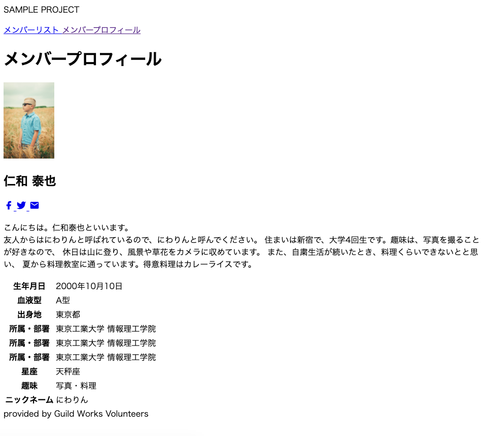

<!-- page_number: true -->
<!-- paginate: true -->

# 2. HTMLで画面の文書を定義しよう

---

## HTMLってなに？

Hyper Text Markup Languageの略。

ハイパーリンクを埋め込んだテキスト文書の、
構造（見出しや段落など）を定義するための言語です。

---

## どうやって書くの？

### タグで囲って意味をしめします。
```
<h1>見出しを示すタグ</h1>
```

### タグは階層構造をつくることもあります。
```
<main>
    <h1>見出しを示すタグ</h1>
</main>
```

### タグは補足情報として属性を持つことがあります。
```

```

---

# さっそく、書いていこう

---


---



---

## HTMLファイルを作成する

1. vscodeのメニューより、File > New Fileと選択する
1. 適当な文書を記載する
1. ファイルをctrl + sで保存する
    - フォルダは、適当なフォルダを作成する
    - ファイル名は、「detail.html」とする
1. 保存したファイルをダブルクリックで開く（ブラウザで開かれる）

---

## HTML書き方にのっとった枠を作る
```
<!DOCTYPE html>
<html lang="ja">
    <head>
        <title>メンバープロフィール | Sample Project</title>
    </head>
    <body>
        メンバープロフィール
    </body>
</html>
```
- DOCTYPE: HTMLであることを宣言する
- htmlタグ: HTMLの文書全体を示す
- headタグ: HTML文書自体の情報（ヘッダ情報）を宣言する部分を示す
    - titleタグ：HTML文書自体のタイトルを示す。
- bodyタグ: HTML文書の本文を示す

---

###

1. 画面を作りながら、タグを理解していこう
    1. 文書の構造を定義する①：<html>, <head>, <body>, <meta>
    2. 文書の構造を定義する②：<header>, <main>, <footer>, <nav>
    3. 文書の構造を定義する③：<h1>, <h2>, <h3>, <p>
    4. 文書の構造を定義する④：<a>, , <svg>
    5. 文書の構造を定義する⑤：<table>, <tbody>, <tr>, <th>, <td>, <ul>, <ol>, <dl>, <li>, 
    6. その他：<div>, <span>

