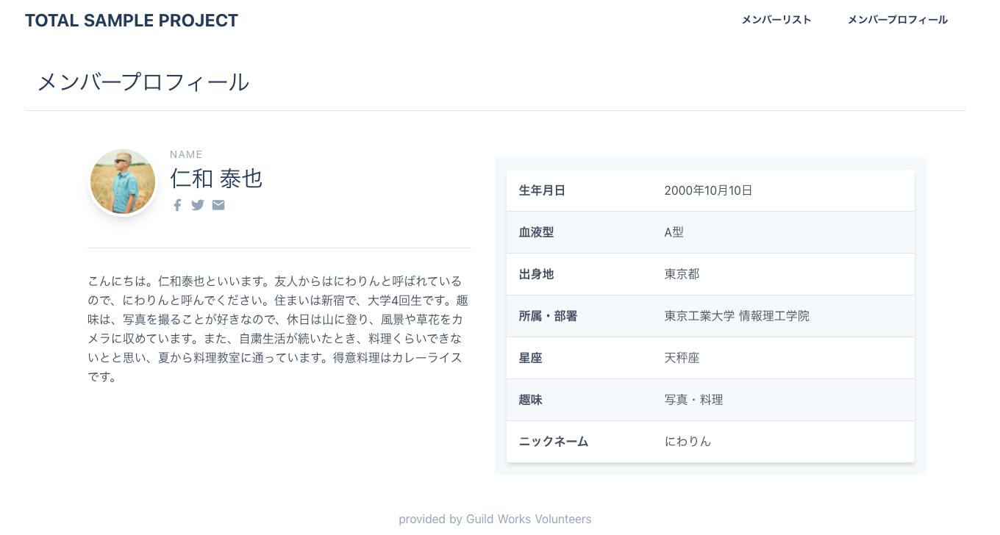

<!-- page_number: true -->
<!-- paginate: true -->

# CSSで画面をレイアウトしよう

---



---

## CSSってなに？

Cascading Style Sheets

HTMLのスタイルを定義する言語。
HTMLの構造に対して、段階的にスタイルを定義できる。

---

## どうやって書くの？

方法は3つあります。
- 要素に直接埋め込む
- ページのヘッダに埋め込む
- 別ファイルで定義したものを読み込む（推奨）　

---

## 要素に直接埋め込む
```
<header style="background-color: red;">
```

## ページのヘッダに埋め込む
```
<head>
    〜中略〜
    <style type="text/css">
        main {
            background-color: blue;
        }
    </style>
</head>
```

---

## 別のファイルに切り出す
HTMLと同じ場所に、style.cssというファイルを作ります。
HTMLに読み込みの定義をします。
```
    <head>
        〜中略〜
        <link rel="stylesheet" href="style".css">
        〜中略〜
    </head>
```

CSSファイルにスタイルを定義してみましょう。

```
footer{
    background-color: yellow;
}
```

---

## スタイルの指定方法
```
header {
    background-color: red;
    color: white;
}
main {
    background-color: blue;
}
```
- セレクタ（スタイルの適用対象）に対して、プロパティ（指定できるスタイル名）と値のセットを指定する
- プロパティと値のセットごとに、区切りとしてセミコロンをつける

---
## セレクタの書き方
```
#greeding {
    font-size: 20px;
}
.icon {
    color: gray;
}
header, footer {
    background-color: lightgray;
}
p {
    background-color: lightblue;
}
.description p {
    color: #800000;
}
```

---

- タグのほか、HTMLに属性をidやclassを追加して指定できる
    - idは画面内で同じ値が重複してはいけない。CSSでは頭に「#」をつけて指定する。
    - classは画面で同じ値を複数指定してよい。CSSでは頭に「.」をつけて指定する。
- スペースで区切って、要素の構造で指定できる
- カンマで区切って、複数の要素を指定できる

---

## 文字を装飾する
以下のような、文字を装飾するプロパティがあります。
```
.description p {
    color: #800000;
    font-size: 14px;
    font-weight: bold;
    font-family: "Meiryo UI", "Hiragino Maru Gothic ProN";
}
```
上記は一例であり、たくさんありますので、
どんなことができるかリファレンスを検索して眺めてみましょう。

---

## ブロックを整形する
以下のようにブロックレベルの要素を整形するプロパティがあります。
```
.description {
    border: 1px solid black;
    margin: 10px;
    padding: 10px;
    width: 500px;
    height: 200px;
}
```

---

## ブロックをレイアウトする
ブロックをレイアウトしてみましょう。

---


---
```
<main>
    <div id="profile">
        <div id="overview">
            <h1>
                メンバープロフィール
            </h1>
            〜中略〜
            <div class="description">
                〜中略
            </div>
        </div>

        <div id="detail">
            <table>
                〜中略〜
            </table>
        </div>
    </div>
</main>
```
メインタグの中を、divタグを使ってブロックで区切ります。
profileの中に、overviewとdetailが並ぶという階層にします。

---

```
#profile {
    display: flex;
}
```

- display: 要素の表示形式を指定するプロパティ
    - flex：要素内のボックスを柔軟に並べて配置する。

画面はブロックが階層になっていたり、並んだりしてレイアウトされていきます。
この考え方は、しっかり身につけておきましょう。

他にも細かな指定ができたり、他のレイアウト手法もありますが、
ここでは割愛します。興味があったら、調べてみましょう。

---

## もくじ

1. 今日のゴール
1. CSSってなに？
1. 画面を装飾しながら、CSSのプロパティを理解しよう
    1. ボックスを装飾しよう：padding, boarder, margin, width, height, background-color
    1. 文字を装飾しよう：font, font-size, font-style, font-weight
    1. レイアウトしよう：float, display(flex)
1. レスポンシブウェブデザインってなに？
1. CSSフレームワークってなに？
1. 画面を装飾しながら、tailwindを理解しよう
    1. ??? 
