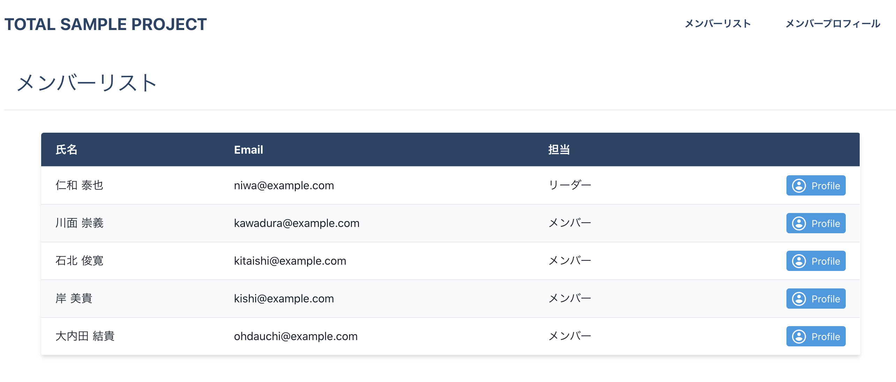
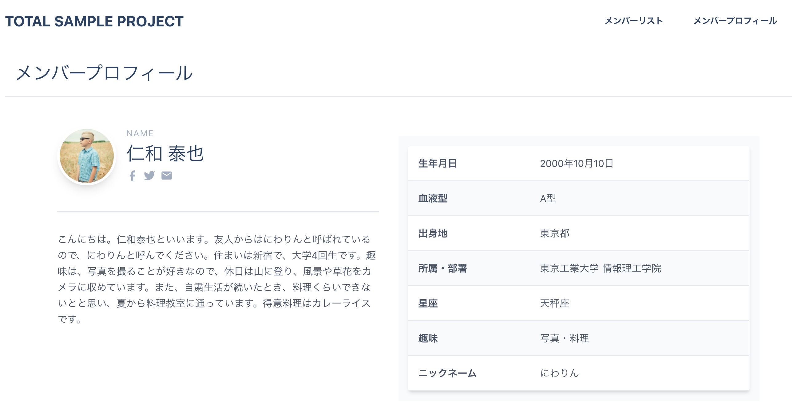
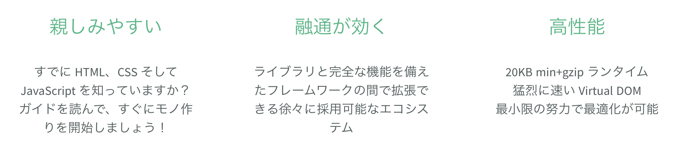
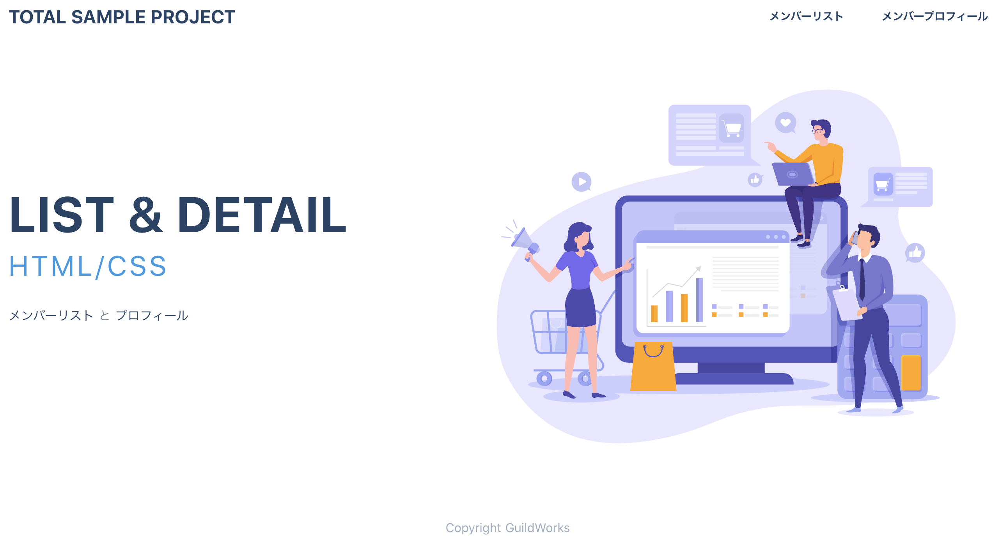

<!-- page_number: true -->
<!-- paginate: true -->

# 第2回： JavaScriptで動きのある画面をつくろう(Vue.js編)

---

## 前回までのふりかえり

HTML、CSS、JavaScriptの基礎を終え、次は本格的にWebアプリケーションの開発を体験していきます。
前回参加しておらず、今回からの参加の方はまずはGithubからソースコードを落としてきてください。

https://github.com/GuildWorks/titech-2020

参考
https://github.com/GuildWorks/titech-2020/blob/master/docs/Phase1/1-1.md

---

前回、HTML、CSS、JavaScriptを利用して、メンバー一覧、メンバー詳細が
~~できあがりました。~~ **できあがりませんでした。。。**

この回では一旦できあがった前提で進みます。

---

# メンバー一覧


---

# メンバー詳細


---

# 2-0 最新のデータを取得しよう

保存先の titech-2020 フォルダに移動して
`git bash` or `Terminal`の画面から以下のコマンドを打ってみましょう。

```
git pull
```

最新のデータが取得できました。
`docs/Phase2`の下に今見ているドキュメントが入っていたら成功です。

---

# 2-1 Vue.jsとは



https://jp.vuejs.org/index.html

---

# 2-2 実行

前回、環境構築で`npm run dev`できるようにしましたが、使いませんでした。
今回はそれがメインになります。

`titech-2020/titech-nuxt-tutorial`フォルダに移動して
`git bash` or `Terminal`の画面から以下のコマンドを打ってみましょう。

```
npm run dev
```

---

# トップページ


---

# 中身