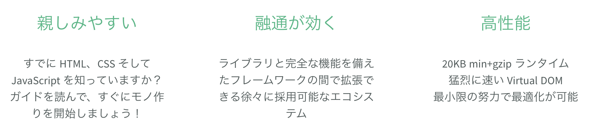

<!-- page_number: true -->
<!-- paginate: true -->
<!-- backgroundColor: aqua -->

# Vue.js

---

## もくじ

1. 
2. 
3. 

---

# 2-1 Vue.js

HTML、CSS、JavaScriptの基礎を終え、次は本格的にWebアプリケーションの開発を体験していきます。
前回参加しておらず、今回からの参加の方はまずはGithubからソースコードを落としてきてください。

TODO URLに置き換える

---

## 前回までのふりかえり

HTML、CSS、JavaScriptを利用して、メンバー一覧、メンバー詳細ができました。
メンバーの一覧を見ることができましたが、詳細はまだ全員同じ人になっています。

---

## メンバー一覧

---

## メンバー詳細

---

## はじめよう

今回からは固定のデータではなく、変化のあるデータを読めるようにしたり
動きのあるサイトに変えていきます。

そのためには **The Progressive JavaScript Framework** である **Vue.js** を利用していきます。

### Vue.js とは
https://jp.vuejs.org/

---

## メンバー一覧

