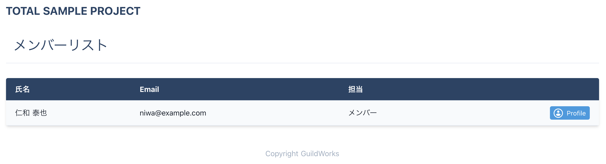
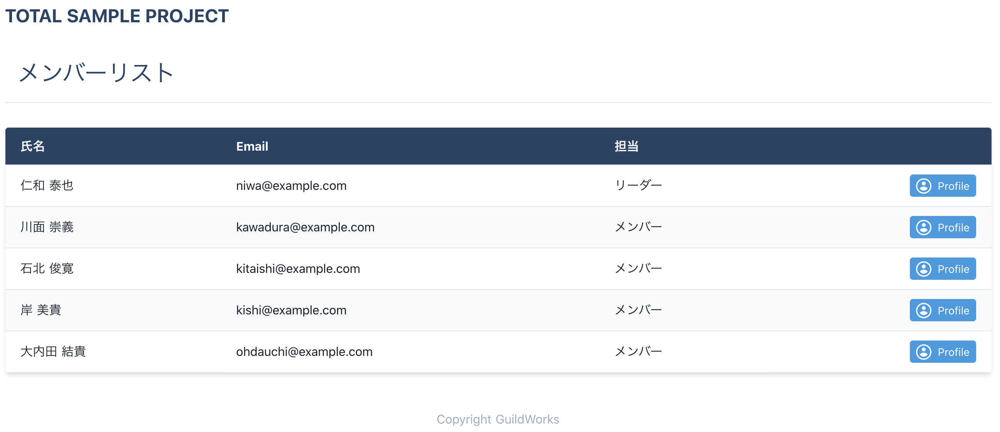

<!-- page_number: true -->
<!-- paginate: true -->

# 第2回： JavaScriptで動きのある画面をつくろう(Vue.js編)

---

# 前回までのふりかえり

HTML、CSS、JavaScriptの基礎を終え、次は本格的にWebアプリケーションの開発を体験していきます。
前回参加しておらず、今回からの参加の方はまずはGithubからソースコードを落としてきてください。

https://github.com/GuildWorks/titech-2020

参考
https://github.com/GuildWorks/titech-2020/blob/master/docs/Phase1/1-1.md

---

前回、HTML、CSS、JavaScriptを利用して、メンバー一覧、メンバー詳細が
~~できあがりました。~~ **できあがりませんでした。。。**

この回では一旦できあがった前提で進みます。

---

# メンバー一覧


---

# メンバー詳細


---

# 2-0 最新のデータを取得しよう

保存先の titech-2020 フォルダに移動して
`git bash` or `Terminal`の画面から以下のコマンドを打ってみましょう。

```
git pull
```

最新のデータが取得できました。
`docs/Phase2`の下に今見ているドキュメントが入っていたら成功です。

---

# 2-1 Vue.jsとは


https://jp.vuejs.org/index.html

---

# 2-2 実行

前回、環境構築で`npm run dev`できるようにしましたが、使いませんでした。
今回はそれがメインになります。

`titech-2020/titech-nuxt-tutorial`フォルダに移動して
`git bash` or `Terminal`の画面から以下のコマンドを打ってみましょう。

```
npm run dev
```

---

# トップページ


---

# 2-3 確認

実行できたら中身を確認していきます。

## 中身の確認

Visual Studio Codeで以下のファイルを開いてみよう。
`titech-2020/titech-nuxt-tutorial/pages/index.vue`

---

```
<template>
  <div
    class="flex flex-col-reverse sm:flex-row jusitfy-between items-center py-12">
    <div
      class="sm:w-2/5 flex flex-col items-center sm:items-start text-center sm:text-left">
      <h1
        class="uppercase text-6xl text-blue-900 font-bold leading-none tracking-wide mb-2">
        List &amp; Detail
      </h1>
      <h2
        class="uppercase text-4xl text-blue-500 text-secondary tracking-widest mb-6">
        HTML/CSS
      </h2>
      <p class="text-gray-600 leading-relaxed mb-6">
        <a href="/list" class="text-blue-900">メンバーリスト</a>
        と
        <a href="/user/0001" class="text-blue-900">プロフィール</a>
      </p>
    </div>
    <div class="mb-16 sm:mb-0 mt-8 sm:mt-0 sm:w-3/5 sm:pl-12">
      <SvgImage />
    </div>
  </div>
</template>
<script lang="ts">
import { defineComponent } from 'nuxt-composition-api'
import SvgImage from '@/components/svg-image.vue'
export default defineComponent({
  components: {
    SvgImage,
  },
})
</script>
<style></style>
```

---

# 説明

```
<template>
  ...
</template>
```

前回学んだHTMLを書くエリアです。

```
<script>
  ...
</script>
```

前回学んだJavaScriptを書くエリアです。

```
<style>
  ...
</style>
```

前回学んだCSSを書くエリアです。

---

`.vue`ファイルの中身は前回学んだものを集めたものです。

なんとなく理解できた気がしませんか。

でも少し中身を見ていきましょう。

---

# template

`<template>` から `</template>` の中にHTMLを記述できます。

```
<template>
  <div>
    ...
  </div>
</template>
```

注意：`<template>`の下は1つのタグである必要があります。

```
<template>
  <div>...</div>
  <div>...</div>
</template>
```

これだとエラーになります。

---

# script

```
<script  lang="ts">
  ...
</script>
```

`lang="ts"`
実はこれは"TypeScript"という言語を指していて、"JavaScript"の代わりとなるプログラミング言語です。

https://www.typescriptlang.org/

簡単に言うと、「型定義ができるJavaScript」です。

---

```
<script  lang="ts">
import { defineComponent } from 'nuxt-composition-api'
import SvgImage from '@/components/svg-image.vue'
export default defineComponent({
  components: {
    SvgImage,
  },
})
</script>
```

```import { defineComponent } from 'nuxt-composition-api'```

これは呪文です
今は必ず必要なものとだけ理解しておきましょう。

```import SvgImage from '@/components/svg-image.vue'```

これはSVGの画像が入っている`svg-image.vue`を利用するよという宣言になります。

---

```
export default defineComponent({
  components: {
    SvgImage,
  },
})
```

`components`の中で利用したいものをコンポーネントとして指定します。

```
<div class="mb-16 sm:mb-0 mt-8 sm:mt-0 sm:w-3/5 sm:pl-12">
  <SvgImage />
</div>
```

`<template>`の中で指定した名前で指定することでコンポーネントを利用できます。

---

以下の部分が読み込まれて表示されています。


---

# 2-4 演習

なんとなく概要は理解できたかもしれませんが、まだ良くわからないと思います。

具体的に手を動かしてみましょう。

---

`titech-nuxt-tutorial/pages/list.vue`を開きましょう

```
<template>

</template>
<script lang="ts">

</script>
<style>

</style>
```

中身は何もありません。
ここに追加していきましょう。

---

もう一度、完成イメージを見ておきましょう。


---

```
<template>
  <div>
    <h1 class="text-2xl sm:text-3xl text-blue-900 p-4 mb-4 md:mb-8 border-b">メンバーリスト</h1>
  </div>
</template>
```

`<template>`から`</template>`中に上記を追加してみましょう。

`npm run dev`が動いていると保存したプログラムが自動的に反映しているはずです。

ブラウザで http://localhost:3000/list を表示してみましょう。

---

```
<template>
  <div>
    <h1 class="text-2xl sm:text-3xl text-blue-900 p-4 mb-4 md:mb-8 border-b">メンバーリスト</h1>
    <div class="list-table shadow-md sm:rounded overflow-y-auto">
      <table class="w-full text-md bg-white">
        <thead>
          <tr class="border-b bg-blue-900 text-white">
            <th class="text-left p-3 px-5">氏名</th>
            <th class="text-left p-3 px-5">Email</th>
            <th class="text-left p-3 px-5">担当</th>
            <th></th>
          </tr>
        </thead>
        <tbody class="text-gray-900">
          <tr
            class="border-b bg-gray-100"
          >
            <td class="py-3 px-5 whitespace-no-wrap sm:whitespace-normal">
              仁和 泰也
            </td>
            <td class="py-3 px-5 whitespace-no-wrap sm:whitespace-normal">
              niwa@example.com
            </td>
            <td class="py-3 px-5 whitespace-no-wrap sm:whitespace-normal">
              メンバー
            </td>
            <td class="py-3 px-5">
              <div class="flex justify-end items-center">
                <a
                  :href="'/user/0001'"
                  class="text-sm bg-blue-500 hover:bg-blue-700 text-white py-1 px-2 rounded focus:outline-none focus:shadow-outline flex items-center"
                >
                  <span
                    class="rounded-full w-5 h-5 bg-white p-0 border-px border-white inline-flex items-center justify-center text-blue-500 mr-2"
                  >
                    <svg
                      fill="currentColor"
                      class="w-5 h-5"
                      xmlns="http://www.w3.org/2000/svg"
                      viewBox="0 0 24 24"
                    >
                      <path d="M0 0h24v24H0z" fill="none" />
                      <path
                        d="M12 2C6.48 2 2 6.48 2 12s4.48 10 10 10 10-4.48 10-10S17.52 2 12 2zm0 3c1.66 0 3 1.34 3 3s-1.34 3-3 3-3-1.34-3-3 1.34-3 3-3zm0 14.2c-2.5 0-4.71-1.28-6-3.22.03-1.99 4-3.08 6-3.08 1.99 0 5.97 1.09 6 3.08-1.29 1.94-3.5 3.22-6 3.22z"
                      />
                    </svg>
                  </span>
                  Profile
                </a>
              </div>
            </td>
          </tr>
        </tbody>
      </table>
    </div>
  </div>
</template>
```

一気に増えます。。。
とりあえずコピペしましょう。

---



こんな画面になったでしょうか。
メンバーリストに1名表示されましたね。

---

やっと下準備は完了です。
ここから本格的にプログラミングぽくなっていきます。

---

## ダミーデータの用意

`titech-nuxt-template/mock/userlist.json`

このファイルを開いて見ましょう。

```
{
  "userlistData": [
    {
      "id": "0001",
      "name": "仁和 泰也",
      "email": "niwa@example.com",
      ...
    },
    ...
  ]
}
```
これは`json`というファイルでダミーデータを定義しています。

---

## ダミーデータの取込

```
<script lang="ts">
import { defineComponent, reactive } from 'nuxt-composition-api'
import userlistJson from '@/mock/userlist.json'
type UserList = {
  id: string
  name: string
  email: string
  role: string
  iconUrl: string
  profile: {
    title: string
    detail: string
  }[]
}
export default defineComponent({
  setup(_) {
    const userList = reactive<UserList[]>(userlistJson.userlistData)
    return {
      userList,
    }
  },
})
</script>
```

---

まずはコピペしましょう。
そして中身を見ていきましょう。

```
import userlistJson from '@/mock/userlist.json'
```

先程説明したダミーデータのファイルを`userlistJson`という名前で定義しています。

`import`はそのファイルを利用するよという宣言と言いました。
それを利用する時には名前をつける必要があります。
今回は`userlistJson`という名前にしています。

---

```
type UserList = {
  id: string
  name: string
  email: string
  role: string
  iconUrl: string
  profile: {
    title: string
    detail: string
  }[]
}
```

型エイリアスというものですが、
型を指定することができる便利なものです。

こうして定義しておくことでダミーデータの取込を行う時に不正なデータが混ざることを回避できます。

---

# 参考

型や変数については #2 ではあまり利用しないので、詳細は #3 にて。

## 型とは

### プリミティブ型
`string`は文字列
`number`は数値
`boolean`は真偽値

参考
https://qiita.com/uhyo/items/e2fdef2d3236b9bfe74a

---

## 変数

```
const label: string = "MemberList" // OK
const label: string = 3            // NG

const num: number = 3              // OK
const num: number = "3"            // NG

const bool: boolean = true         // OK
const bool: boolean = "false"      // NG
```

型が正しくないものはエラーになる。

```
const label: string = "MemberList"
label = "Change" // NG

let label2: string = "MemberList"
label2 = "Change" // OK
```

不変なものは`const`で、可変なものは`let`を使う。

---

## 配列

```
const name: string[] = ["上野", "今橋", "京極"]
name.push("金"))                              // 配列の最後に`4`を追加する

console.log(name)                            // ["上野", "今橋", "京極", "金"]
console.log(name[1])                         // "今橋"
```

複数のデータを持つ場合は配列を利用する
配列は`0`番目から始まるので注意

`shift()`は先頭を削除
`pop()`は末尾を削除

---

話を戻します。

```
export default defineComponent({
  setup(_) {
    const userList = reactive<UserList[]>(userlistJson.userlistData)
    return {
      userList,
    }
  },
})
```

見慣れないものが増えています。

`setup(_)`はこのページが呼び出された時に実行されます。
画面で利用したいものは`return`で返します。

---

```
const userList = reactive<UserList[]>(userlistJson.userlistData)
```

`titech-nuxt-tutorial/mock/userlist.json`のファイルの中から
`userlistJson.userlistData`でダミーデータを取得します。

```
{
  "userlistData": [
    ...
  ]
}
```

`import`で指定した名前で、ファイルの中の`userlistData`を取得しています。

取得する際に型エイリアスで定義した`UserList`の配列を指定することでデータにエラーが発生しないようにしています。

取得したダミーデータを画面で使えるように`return`に指定します。

---

ダミーデータを取れたのでメンバー一覧に表示させましょう。

```
<tr
  v-for="(user, index) in userList"
  :key="index"
  class="border-b bg-gray-100"
>
```

17行目の`tr`に上記を追加します。

ブラウザで表示すると`仁和`さんがいっぱい表示されてますね。。。
それでも一旦成功です。

---

## for文

```
v-for="(user, index) in userList" :key="index"
```

`Vue.js`では`template`の中でループを実行することができます。

`v-`は`Vue`の`v`ですね。
`v-xxx`というシリーズは`Vue`で用意されているものです。

`userList`これは`<script>`の中で`return`に指定したものです。
ダミーデータの配列が入っています。

ここでは配列の中から1データずつ取得したいので、`for`を利用します。

`(user, index)`これで配列の1つを`user`に格納されます。
`index`はインデックス(カウンタ)が格納されます。

---

ループしても`仁和`さんしか出ない理由は取得したデータを利用していないからです。

```
<td class="py-3 px-5 whitespace-no-wrap sm:whitespace-normal">
  仁和 泰也
</td>
...
```

データを利用できるように変更しましょう。

```
<td class="py-3 px-5 whitespace-no-wrap sm:whitespace-normal">
  {{ user.name }}
</td>
```

これだけです。

`user`変数にデータが1つずつ入っているので、`user.name`で名前を取得できます。

ブラウザで表示すると、名前だけ変わってますね。

---

他のデータも変更してみましょう。

```
<td class="py-3 px-5 whitespace-no-wrap sm:whitespace-normal">
  {{ user.email }}
</td>
<td class="py-3 px-5 whitespace-no-wrap sm:whitespace-normal">
  <template v-if="user.role === 'admin'">リーダー</template>
  <template v-else>メンバー</template>
</td>
```

`Email`と`担当`も変更されましたね。

よく見るとまた見知らぬ`v-if`と`v-else`がありますね。

これも`Vue`で利用できるものです。

---

## if文

```
<template v-if="user.role === 'admin'">リーダー</template>
<template v-else>メンバー</template>
```

`v-if`の条件が`true`なら実行されます。
`false`なら`else`が実行されます。

ダミーデータを見ると、`仁和`さんだけ`admin`で他の人は`member`ですね。

したがって、`user.role`の中身が`admin`かをチェックしているので`仁和`さんだけがリーダーになります。
(`===`は同じ値なら`true`、異なるなら`false`になります)

---

Profileボタンをクリックしたときには、その人の詳細ページに遷移したいですよね。
そこも変更しておきましょう。
(まだ詳細ページはありませんが)

```
:href="'/user/' + user.id"
```

`仁和`さんなら
http://localhost:3000/user/0001
`川面`さんなら
http://localhost:3000/user/0002

---

一覧の最後に見た目の調整もしましょう。

```
<style>
tbody tr:nth-child(odd) {
  @apply bg-white;
}
</style>
```

`style`の中にCSSを追加しました。
行が`odd`(奇数)の時に行の色を白に指定しています。

---

## 一覧の完成



---

