**Programming Boot Camp #3**

# 第3回： ユーザー登録、ユーザー認証、データベース連携(Firebase編)

**東京工業大学 2020/11/14**
　
　
　
　
　
　　　　　　　　　　　　　　　　　　　　　　　　**Ryo Imahashi**


---
## 目次
- 前回までのふりかえり
- 今回やることの確認
- Firebaseってなに？
- Firebaseを使う準備をしよう
- ユーザー登録をしよう
- ユーザー認証をしよう
- データベース連携をしよう
- 参考

---
## 前回までのふりかえり
- 第1回では、HTML、CSS、Javascriptの基礎を学びました。
  - [参考: 第1回資料](https://github.com/GuildWorks/titech-2020/blob/master/docs/Phase1)
- 第2回では、Vue.js(Nuxt.js)の基礎を学びました。
  - [参考: 第2回資料](https://github.com/GuildWorks/titech-2020/blob/master/docs/Phase2)


---
#### 開発環境を整えよう
- 今回が初参加の方は、ご自身のPCで開発をするための環境構築をしましょう。ギルドワークスのメンバーがフォローしますので、声を掛けてください。
  - [参考: 環境構築の資料](https://github.com/GuildWorks/titech-2020/blob/master/docs/Phase1/1-1.md)
- 環境構築ができている方は、[GitHub上のリモートリポジトリ](https://github.com/GuildWorks/titech-2020)から最新のコードを落としてきてください。
  - `titech-2020`ディレクトリでGitBash(Terminal)を開いて、以下のコマンドを実行しましょう。
    ```
    git pull
    ```
  
---
#### 前回作ったアプリの確認
- ふりかえりのため、前回作ったアプリを動かして確認しましょう。
  - GitBash(Terminal)で以下のコマンドを実行しましょう。
    ```
    # から始まる行はコメントなので、実行されません

    # 現在位置がtitech-2020ディレクトリの場合、移動する
    cd titech-nuxt-day2-answer

    # 必要なモジュールをインストール
    npm install

    # アプリを起動
    npm run dev
    ```
  - その後、http://localhost:3000/ にアクセスしましょう。
---
#### トップ画面

http://localhost:3000/

---
#### メンバー一覧
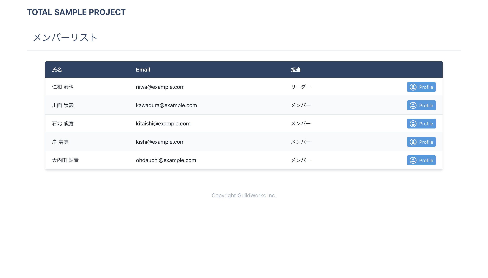
http://localhost:3000/list

---

#### メンバー詳細
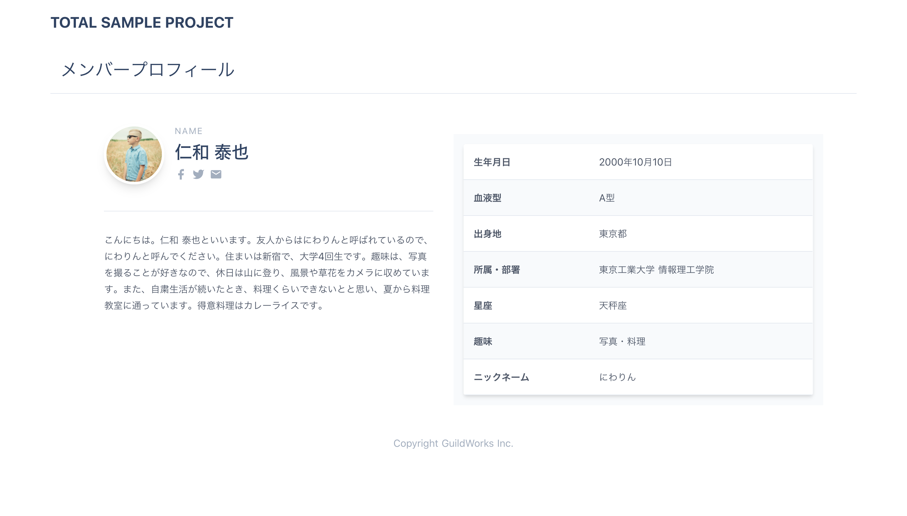
http://localhost:3000/user/0001

---
#### 気になるところ
- 表示内容が変わりません。
  - 表示しているデータは実際に登録したものではなく、[ダミーデータ](https://github.com/GuildWorks/titech-2020/blob/master/titech-nuxt-day2-anser/mock/userlist.json)です。
    - ユーザーの追加ができません。
    - プロフィールの更新ができません。
- ログインをしなくても、誰でもデータを見ることができてしまいます。

---
## 今回やることの確認
開発する機能や画面は、以下の通りです。
- ユーザー登録
- ログイン
- ログアウト
- ログイン状態によるメニューの表示制御
- プロフィール編集
- あなたのプロフィール
- メンバーリスト(実際に登録したデータを表示)
- メンバープロフィール(実際に登録したデータを表示)

---
#### ユーザー登録
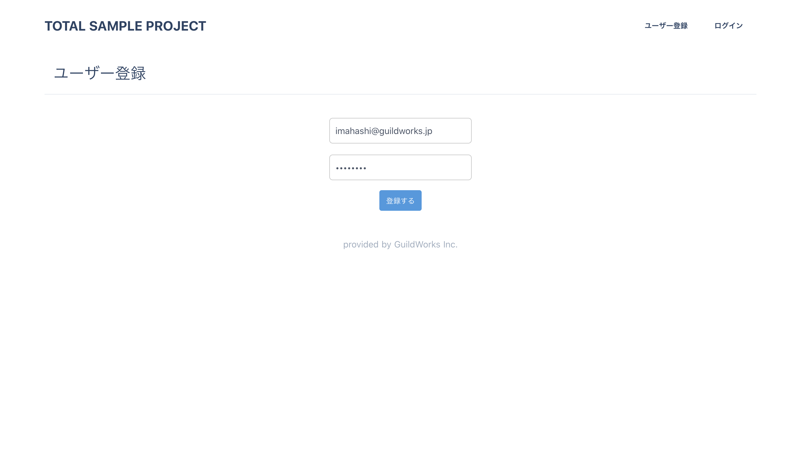

---
#### ログイン
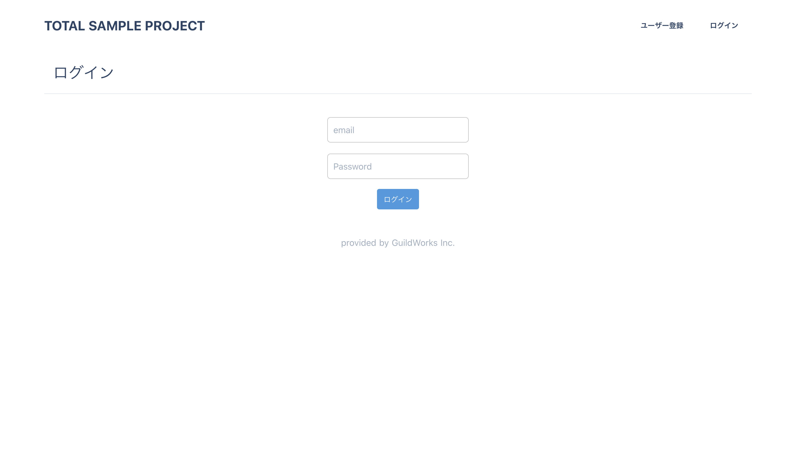

---
#### ログアウト、ログイン状態によるメニューの表示制御
ログインしている時


ログインしていない時


---
#### プロフィール編集
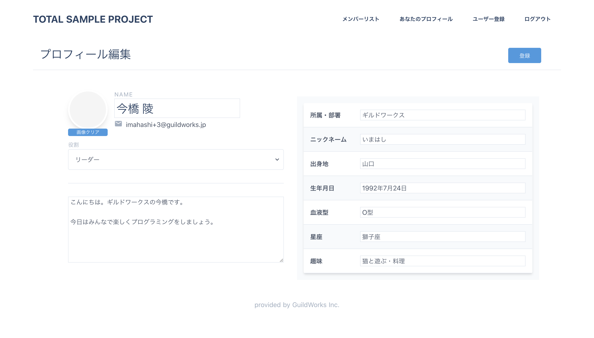

---
#### あなたのプロフィール
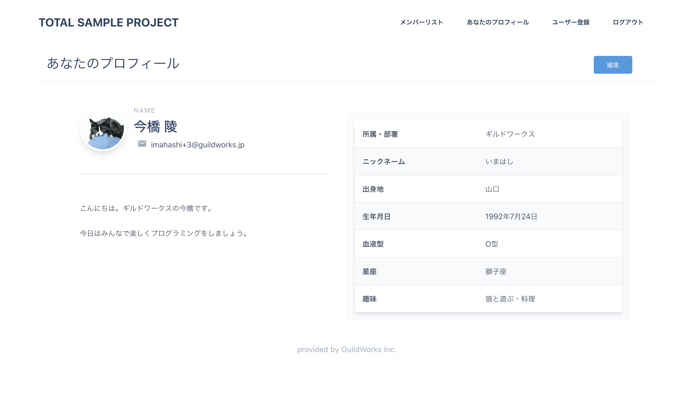

---
#### メンバーリスト(実際に登録したデータを表示)
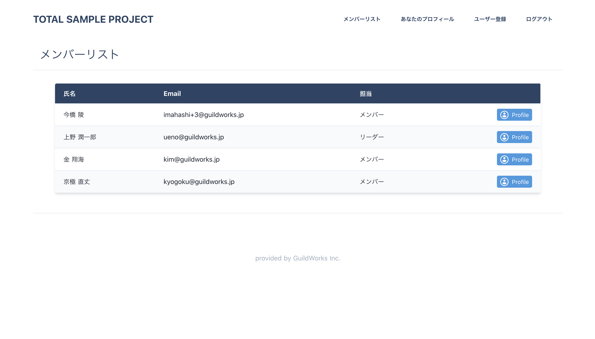

---
#### メンバープロフィール(実際に登録したデータを表示)
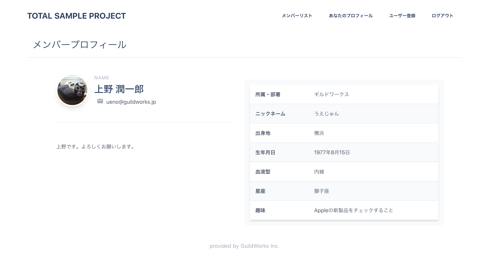

---
- 今回修正していくアプリの現在の状態を確認しておきましょう。
  - 先ほど使ったGitBash(Terminal)で、[Ctrl]+[C]キーを押して、アプリを停止しておきましょう。
  - 以下のコマンドを実行しましょう。
    ```
    pwd  # 現在位置の確認
    cd ..   # 一階層上がる
    pwd  # もう一度、現在位置の確認
    cd titech-nuxt-firebase-tutorial  # 今回修正していくアプリのディレクトリに移動
    npm install  # 必要なモジュールをインストール
    npm run dev  # アプリを起動
    ```
  - その後、http://localhost:3000/ にアクセスしましょう。
    - 各画面や機能の雛形を追加してあるのが分かると思います。
---


- 今回開発する機能に必要な、アプリケーションのバックエンド処理を使えるようにしましょう。
  - 第1回、第2回で作ったのはフロントエンド(アプリケーション)です。ブラウザ側で動作します。
  - バックエンド(アプリケーション)は、インターネットの先で動いて、必要なデータを返してくれます。サーバーサイド(アプリケーション)ともいいます。
  - フロントエンド-バックエンドという対比や、クライアントサイド、サーバーサイドという対比で語られることが多いです。
- このブートキャンプでは、バックエンドを1から開発することはせず、代わりにFirebaseというサービスを利用します。

---
## Firebaseってなに？
- Firebase は Google が提供しているモバイルおよび Web アプリケーションのバックエンドサービスです。Firebase を使うことで、開発者はアプリケーションの開発に専念でき、バックエンドで動くサービスを作成する必要も管理する必要もありません。
- サーバーやデプロイが不要で、簡単にバックエンド処理を利用できるようになります。
- 無料枠がありますので、それを使っていきましょう。

---
## Firebaseを使う準備をしよう
- 以下のリンクにアクセスしましょう。
  - https://console.firebase.google.com/?hl=ja&pli=1
- Googleアカウントのログインを求められた場合、
  - 既にGoogleアカウントを持っている人は、ログインをしましょう。
  - Googleアカウントを持っていない人は、左下の「アカウントを作成」リンクをクリックして、アカウントを作成しましょう。
  
  

---
- こんな画面が表示されたらOKです。
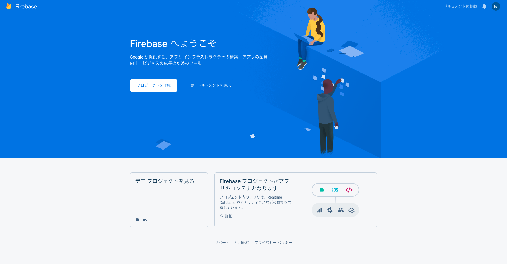
- 「プロジェクトを作成」をクリックしましょう。


---
- プロジェクトに名前をつけて、「続行」をクリックしましょう。
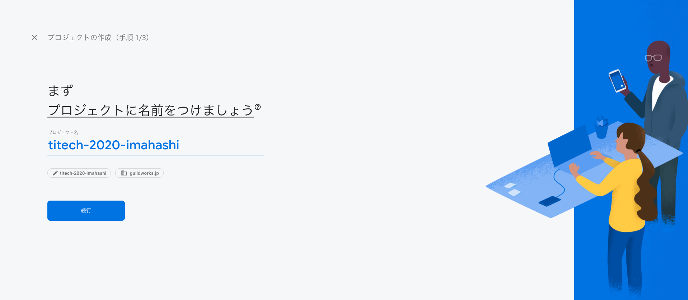

---
- Googleアナリティクスを無効にして、「プロジェクトを作成」をクリックしましょう。
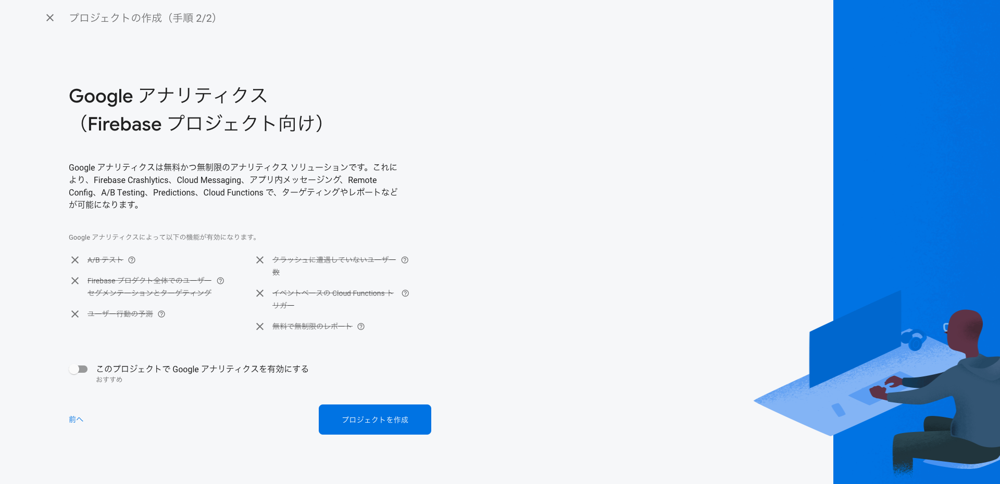
- 
---
- プロジェクトが作成できたら、「続行」をクリックしましょう。
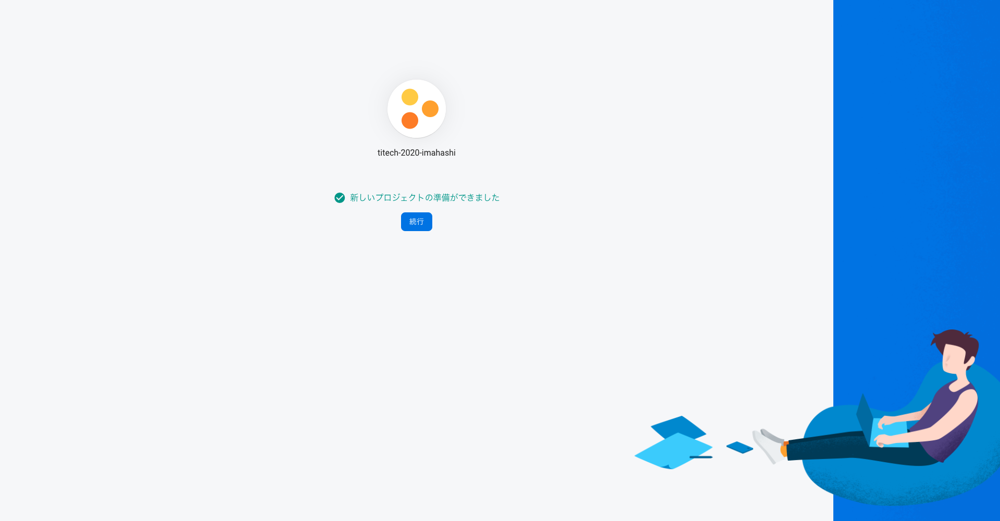

---
- これが作成されたプロジェクトの画面です。このプロジェクトを使って開発を進めていきます。
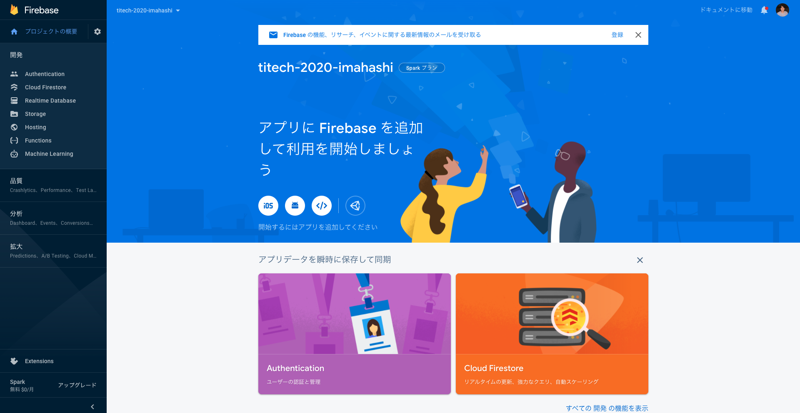

---
#### 今回開発するアプリでFirebaseの初期設定をしよう
- 画面左上の歯車アイコンをクリックして、「プロジェクトを設定」を選択しましょう。
  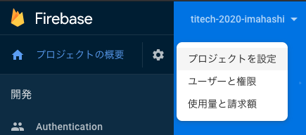

---
- 画面下部マイアプリ欄の 「</>」アイコンをクリックして、プロジェクトにWebアプリを作成しましょう。
  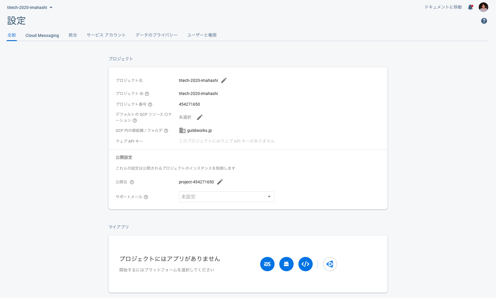

---
- アプリのニックネームを入力して、「アプリを登録」をクリックしましょう。
  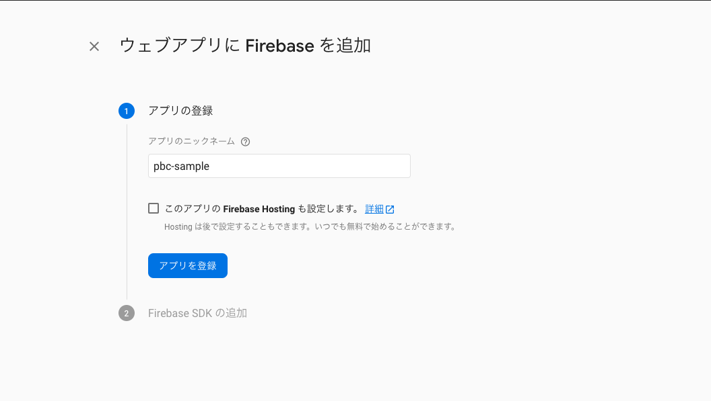

---
- 選択中の箇所(apiKeyからappIdまでの行)をコピーしましょう。
  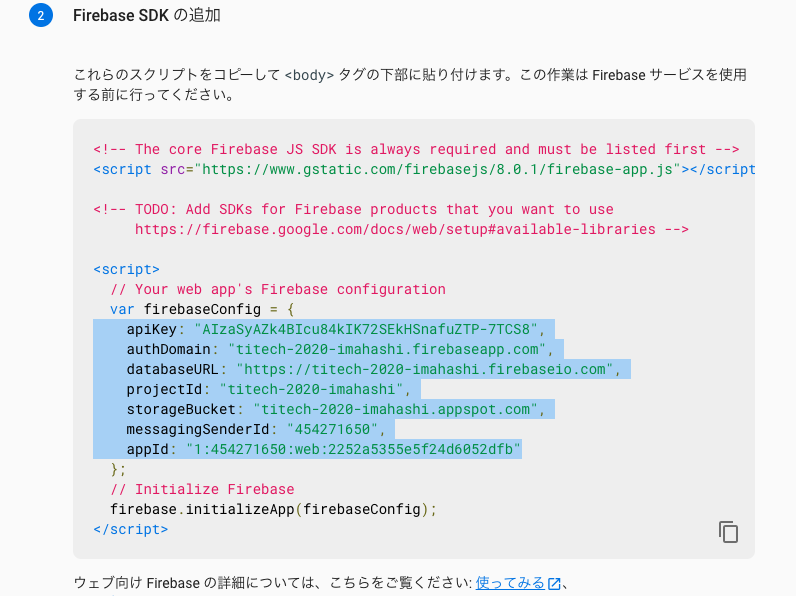

---
- Visual Studio Codeを開いて、コピーした設定を`/titech-nuxt-firebase-tutorial/plugins/firebase.ts`に貼り付けましょう。
  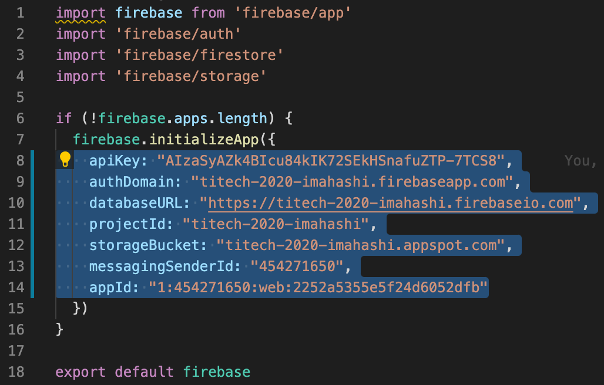
- これで、Firebaseの初期設定は完了です。

---
## ユーザー登録機能を作ろう
- Firebase Authenticationを使います。
  - 認証機能を提供してくれるサービスです。
  - 様々な方法での認証をサポートしています。
    - メールアドレスとパスワード
    - Googleアカウント
    - Facebookアカウント
    - Twitterアカウント
    など

---
#### Firebase側の設定
- 左側のメニューで「Authentication」を選んで、「始める」をクリックしましょう。
    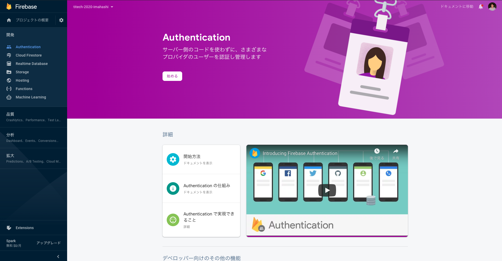

---
- 今回は、メールアドレスとパスワードによる認証を使うため、「メール/パスワード」をクリックしましょう。
  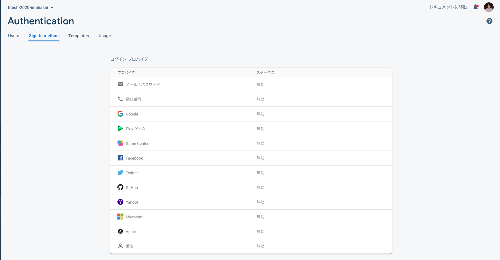

---
- 1つ目のスライダーをクリックして有効化し、「保存」をクリックしましょう。
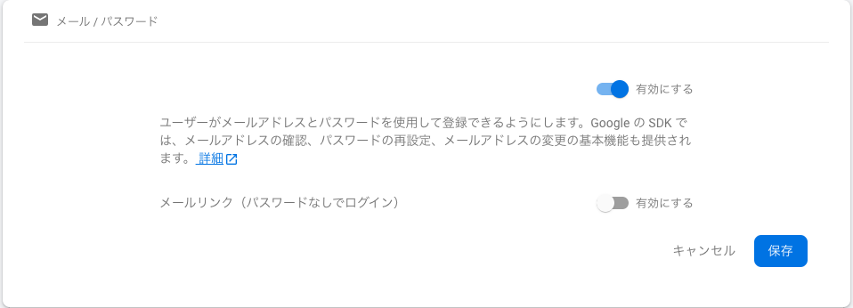
- これで、メールアドレスとパスワードによる認証機能が使えるようになります。
---
#### プログラムの編集
- `/pages/signup.vue` を開きましょう。これが、ユーザー登録画面のファイルです。
- 「登録する」ボタンを押した時に実行される `submit()` 関数の中身が空になっています。
  ```
      function submit() {
        // TODO
      }
  ```
  - この関数内で、Firebase Authenticationが提供している、メールアドレスとパスワードによるユーザー登録処理を呼び出すことで、ユーザー登録を行えるようにします。
--- 
- `/pages/signup.vue`内でFirebaseを扱えるようにするために、firebaseをインポートしましょう。
  ```
  <script lang="ts">
  import { defineComponent, ref } from 'nuxt-composition-api'
  import PageHeading from '@/components/page-heading.vue'
  import firebase from '@/plugins/firebase.ts' // この行を追加
  ```


---
- 以下のリンクを開いてください。
  https://firebase.google.com/docs/auth/web/password-auth#create_a_password-based_account
  - メールアドレスとパスワードによるユーザー登録処理を呼び出すためのコードが記載されています。
- コードブロック右上の「Copy code sample」アイコンをクリックして、コピーしてください。
  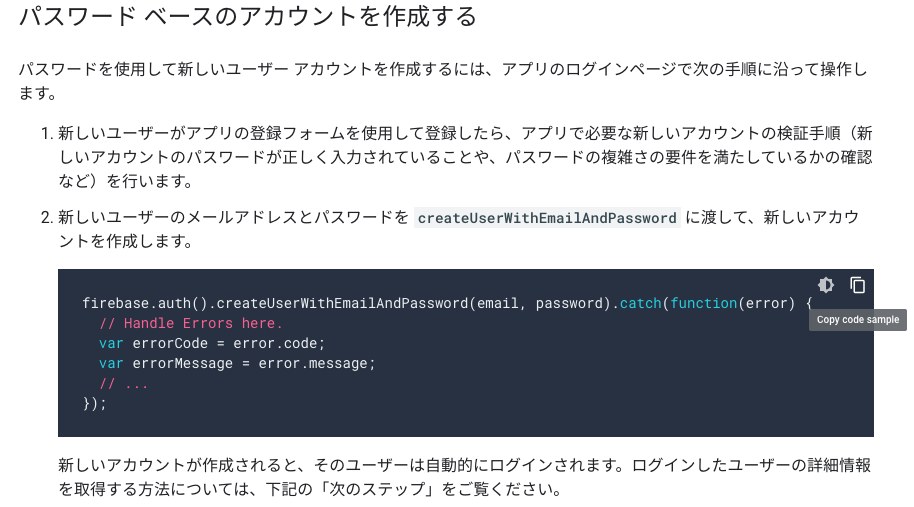


---
- コピーしたコードを、`submit()`関数内に貼り付けてください。
  ```
      const state = reactive({
        email: '',
        password: ''
      })
      function submit() {
        firebase.auth().createUserWithEmailAndPassword(email, password).catch(function(error) {
          // Handle Errors here.
          var errorCode = error.code;
          var errorMessage = error.message;
          // ...
        });
      }
  ```
---
- そのままだと動かないので、`createUserWithEmailAndPassword()`の引数`email`を`state.email`に、`password`を`state.password`に変更します。
  ```
      const state = reactive({
        email: '',
        password: ''
      })
      function submit() {
        firebase.auth().createUserWithEmailAndPassword(state.email, state.password).catch(function(error) {
          // Handle Errors here.
          var errorCode = error.code;
          var errorMessage = error.message;
          // ...
        });
      }
  ```
- 画面に入力した`email`,`password`が、`createUserWithEmailAndPassword()`に渡され、それらを含めたユーザー登録処理のリクエストが実行されるようになります。
---
- 画面を操作して実際にユーザーを登録してみましょう。
  -  メールアドレスとパスワードを入力し、登録するボタンを押してみてください。
    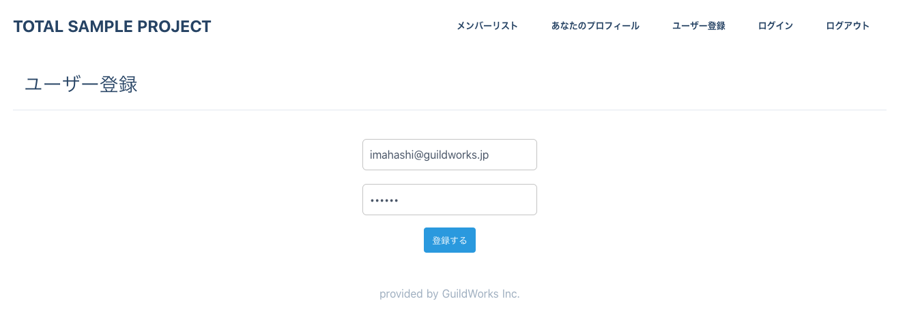

---
- Firebase Authenticationで、ユーザーが登録されたことが確認できます。
    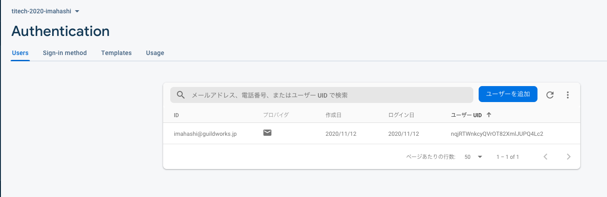


---
- ブラウザで開発者ツールを開きましょう(Chromeの場合、右クリックをして「検証」を選択)。
- 上部のタブからNetworkタブ選択してください。
  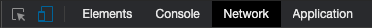
- この状態で、先程と同じメールアドレスを使って再度ユーザー登録をしてみましょう。
---
- `EMAIL_EXISTS`というメッセージのエラーが起きています。
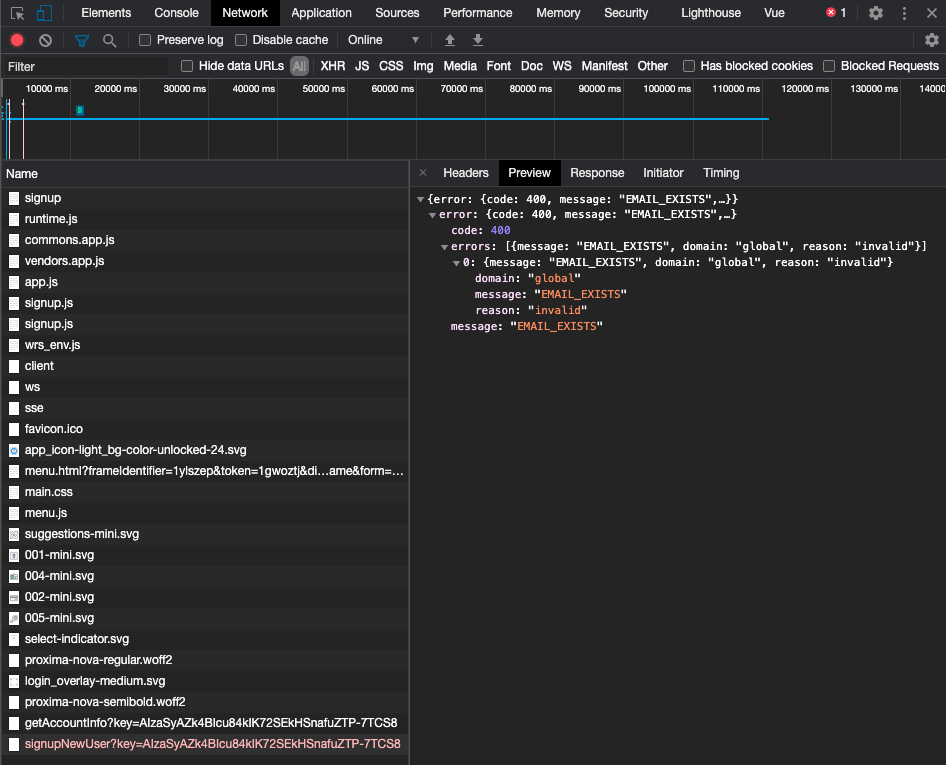
  - 同じメールアドレスで複数のユーザーは登録できないように、Firebase Authenticationのデフォルト設定で制限されているためです。

---
- エラーが起きた場合、それが分かるようにしましょう。`submit()`を以下のように修正してください。
```
    function submit() {
      firebase.auth().createUserWithEmailAndPassword(state.email, state.password).catch(function(error) {
        // Handle Errors here.
        alert('ユーザー登録が失敗しました。errorCode: ' + error.code + ', errorMessage:' + error.message)
      });
    }
```
  - エラーが出ると、以下のようなポップアップが出るようになります。再度同じメールアドレスでユーザー登録をしてみてください。
    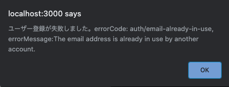

---
## ユーザー認証(ログイン)機能を作ろう
- ここでも、Firebase Authenticationを使います。
- `/pages/signin.vue` を開きましょう。これが、ログイン画面のファイルです。
- 「ログイン」ボタンを押した時に実行される `submit()` 関数の中身が空になっています。
  ```
      function submit() {
        // TODO
      }
  ```
  - この関数内で、メールアドレスとパスワードによるログイン処理を呼び出すことで、ログインできるようにします。
--- 
- `/pages/signup.vue`内でFirebaseを扱えるようにするために、firebaseをインポートしましょう。
  ```
  <script lang="ts">
  import { defineComponent, ref } from 'nuxt-composition-api'
  import PageHeading from '@/components/page-heading.vue'
  import firebase from '@/plugins/firebase.ts' // この行を追加
  ```

---
- 以下のリンクを開いてください。
  https://firebase.google.com/docs/auth/web/password-auth#sign_in_a_user_with_an_email_address_and_password
  - メールアドレスとパスワードによるログイン処理を呼び出すためのコードが記載されています。
- コードブロック右上の「Copy code sample」アイコンをクリックして、コピーしてください。
  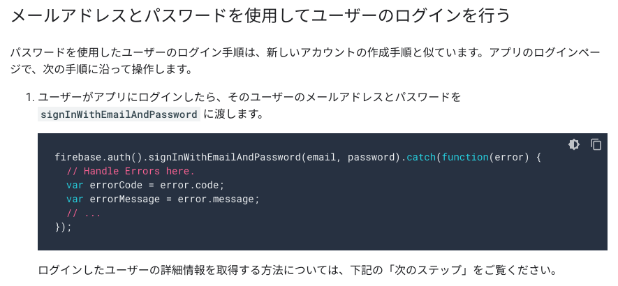


---
- コピーしたコードを、`submit()`関数内に貼り付けてください。
  ```
      const state = reactive({
        email: '',
        password: ''
      })
      function submit() {
        firebase.auth().signInWithEmailAndPassword(email, password).catch(function(error) {
          // Handle Errors here.
          var errorCode = error.code;
          var errorMessage = error.message;
          // ...
        });
      }
  ```

---
- `signInWithEmailAndPassword()`の引数`email`を`state.email`に、`password`を`state.password`に変更しましょう。
- ログイン失敗時のアラートを追加しましょう。
```
    const state = reactive({
      email: '',
      password: ''
    })
    function submit() {
      firebase.auth().signInWithEmailAndPassword(state.email, state.password).catch(function(error) {
        // Handle Errors here.
        alert('ログインが失敗しました。errorCode: ' + error.code + ', errorMessage:' + error.message)
      });
    }
```
- 画面に入力した`email`,`password`が、`signInWithEmailAndPassword()`に渡され、それらを含めたログイン処理のリクエストが実行されるようになります。
---
- 画面を操作して実際にログインしてみましょう。
  -  メールアドレスとパスワードを入力し、ログインボタンを押してみてください。
    - 先程作成したユーザーのメールアドレスとパスワードに一致していれば、何も起こらないと思います(ログインに成功しています)。
    - 先程作成したユーザーとメールアドレスが異なっていれば、`auth/user-not-found`エラーが起きます。
    - 先程作成したユーザーとメールアドレスが一致し、パスワードが異なっていれば、`auth/wrong-password`エラーが起きます。

---
- ログイン状態を保持しましょう。
https://firebase.google.com/docs/auth/web/auth-state-persistence#modifying_the_auth_state_persistence


---
  - コードを説明して実装してもらう
- データベース連携をしよう
  - Cloud Firestoreを使う
    - データベースとそこへのアクセスを提供してくれる
    - データベースとは
      - TODO:データベースの説明
    - そこへのアクセスとは
      - TODO:CRUDの説明
  - コードを説明して実装してもらう
    - mock/userlist.jsonの構造が前回から変わっているので、要説明
- おまけ：写真をアップロードしよう
  - Cloud Storage for Firebaseを使う
    - 写真や動画などバイナリーデータを保存してくれるサービス。
  - コードを説明して実装してもらう
- もっと勉強したい人は、アプリを自由にカスタマイズしてみよう
  - どんな機能があったら良さそう？
    - プロフィール項目にプラグラミング経験を追加するとか
    - 他の人のプロフィール欄にコメントをつけられるようにするとか
    - チャット機能をつけるとか
- 細かく説明しきれないところをざっくり
  - ログイン前後のメニュー項目の変化
    - middlewareで制御している
- その他、紹介したいこと
  - Gmailのエイリアス機能(+でアドレスを増やせるやつ)
  - 作ったアプリをインターネット上に公開したい時の参考記事
  - nuxtのフォルダ構成とそれぞれの意味
--- 
<!-- TODO: Delete -->
# 参考にしたものをまとめておく
https://www.topgate.co.jp/firebase01-what-is-firebase

https://www.slideshare.net/KenjiroKubota/firebase-129555773

https://ja.wikipedia.org/wiki/Firebase
Firebase Authenticationは、クライアント側のコードのみでユーザーを認証できるサービスである。ソーシャルログインプロバイダであるFacebook、GitHub、Twitter、Googleをはじめ、Google Play Games、Apple、Yahoo、Microsoftなどのサービスプロバイダをサポートしている。また、ユーザー管理システムを搭載しており、開発者はFirebaseに保存されている電子メールとパスワードによるユーザー認証を有効にすることができる
