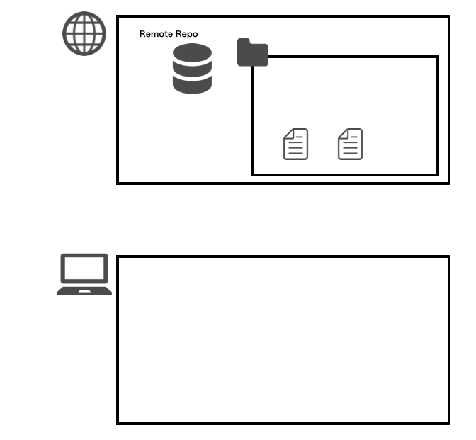
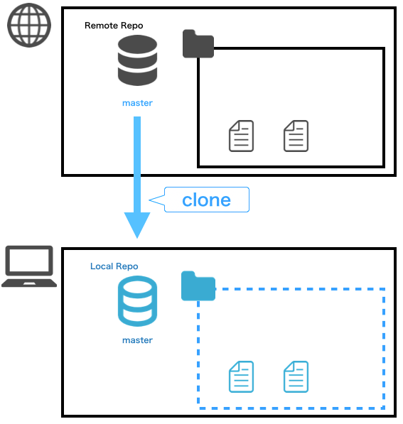
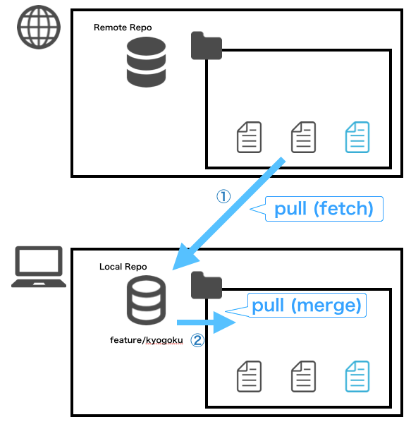
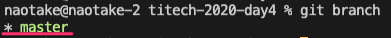
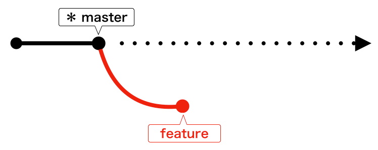
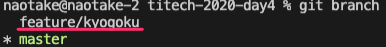
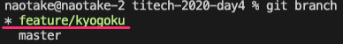
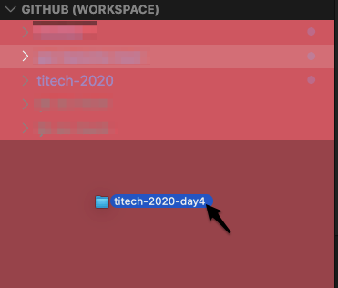
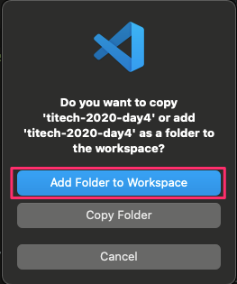
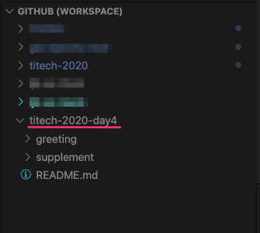

**Programming Boot Camp #4**

# 第 4 回： チーム開発に必要なこと

**東京工業大学 2020/11/28**
　
　
　
　
　
　　　　　　　　　　　　　　　　　　　　　　**Naotake Kyogoku**

---

### :jack_o_lantern: 前回までのふりかえり :jack_o_lantern:

----

### 今日やること

**Git コマンドのあんちょこを用意しておく**

:white_check_mark: チーム開発に必要なこと：開発編

* Git の一通りのコマンドを学ぶ
* GitHub の Pull & Request を使い、コードレビューを学ぶ
* コードのコンフリクトが発生した時の対処法を学ぶ

:white_check_mark: チーム開発に必要なこと：コミュニケーション編

* 普段行うコミュニケーション
* 定期的に行うコミュニケーション

----

# それでは早速行ってみよう
<!-- 中央揃え -->

----

:white_check_mark: チーム開発に必要なこと：開発編

* Git の一通りのコマンドを学ぶ
* GitHub の Pull & Request を使い、コードレビューを学ぶ
* コードのコンフリクトが発生した時の対処法を学ぶ

----

### まずは Git のおさらい

> 開発中のコードのバージョン管理をすることで、
> 特定の開発タイミングの状態に戻る／進むといったことが
> 容易になったり、他の開発者との共同編集がやりやすくなります

----

※第 1 回講義資料より


出典：[GitとSubversionの構造的な違い - Ricksoft Blog](https://www.ricksoft.jp/blog/archives/9483/)

----

### なぜ Git がチーム開発において必要なのか :sunglasses:

----

### Git の基本的な操作

Git には様々なコマンドが用意されています。
これからそのコマンドを少し学んでいくのですが
その前に。
Git がどういう物なのかを学んで行きます。

----

複数人で開発しているときに、同じ実体を触っていると
常に様々なファイルが変更されてしまい
自分が最初にみていた時と違う状態になっている可能性があります
そして、それは他の人目線でも同じことが言えます

----

そこで Git では **ブランチ（枝）** と呼ばれるものを使って
複数人で開発するときのいろいろな面倒ごとを解消しています

このブランチが何かというと...

まずみなさんが本講義を受ける時に初めて叩いたコマンドがこれでした。

```bash
git clone https://github.com/GuildWorks/titech-2020.git`
```

----

このコマンドが何をやっているかというと... :thinking:

* `git` で Git のコマンドであることを示します
* 次に Git の `clone` コマンドを実行します
* この `clone` は、その後に続く「リモートリポジトリ」の内容をもとに「ローカルリポジトリ」を作るコマンドになります
* この時、リモートリポジトリから **どのブランチ** の状態を持ってくるかが重要になってきます
* 最初に叩いたコマンドではブランチ名を省略していますが、この場合は、対象となるリモートリポジトリに設定されているデフォルトブランチ（今回なら `master` ブランチ）の状態を持ってきます

----

* もし、特定のブランチの状態を指定してリモートリポジトリの内容を持ってきたい場合はこんな感じになります

```bash
git clone -b feature/phase4 https://github.com/GuildWorks/titech-2020.git
```

----





----

今までの #1 ~ #3 までで利用していた titech-2020 のディレクトリを
そのまま利用すると、過去の編集でたくさんの差分が発生しています

なので、今日のワークショップ用に下記コマンドを叩いて新しくローカルリポジトリを取得しましょう

----

⚠️このコマンドを実行するのは、今まで利用していた titech-2020 の
一つ上の階層で実行してください！

```bash
# titech-2020 のディレクトリに移動

# 一つ上の階層に移動
cd ../

# 今日のワークショップ用に再度 clone
git clone https://github.com/GuildWorks/titech-2020.git titech-2020-day4
```

実行できましたかね？
まだの人ーー 🙋‍♀️ ？

----

OK。もう 1 つ。

みなさんが馴染みのあるコマンドを見てみましょう。

```bash
git pull
```

----

このコマンドが何をやっているかというと... :thinking:

* Git の `pull` コマンドを実行しています
* この `pull` は、今見ている **ブランチ** の内容を最新化するコマンドになります
* 先程の例だと、今見ている **ブランチ** は `master` ブランチとなります

----

内部的には...

1. リモートリポジトリからローカルリポジトリへ
  `git fetch`
2. そして、ローカルリポジトリから作業ディレクトリへ
  `git merge`

を一発で行っているコマンドになります💪



----

では、今見ているブランチが本当に `master` ブランチなのか確かめてみましょう👀

先程 clone してきた `titech-2020-day4` の直下で `git branch` コマンドを実行してみましょう

----

すると、今のブランチ名の横に `*` が付いていると思います。
GitBash や Terminal を使っていれば、文字色も変わっているはず :smile:




このコマンドは、現在「ローカルリポジトリ」にどういったブランチが存在し、現在はどのブランチを向いているのかを確認するコマンドになります。

----

少しは **ブランチ** というものが身近になりましたかね :heart:

----

では、今度は新しいブランチを作成してみましょう。
新しいブランチを作成するイメージは、文字通り枝分かれするイメージとなります。



これは `master` ブランチから `feature` ブランチが枝分かれするイメージ

----

では早速ブランチを作成してみましょう。

```bash
git branch feature/{your-name}
```

`{your-name}` の部分はご自身の苗字を当てはめてください。
例えば私なら `feature/kyogoku` となるので

```bash
git branch feature/kyogoku
```


----

特に何もおこなかったと思います。
本当にブランチが作成されたか見てみましょう。

...何のコマンドを使えば良いかわかりますよね :kiss:？

そうです！
先ほども叩いた `git branch` コマンドになります。

----

```bash
git branch
```

すると、最初に `git branch` を叩いた時にあった `master` ブランチの他に、先ほど作成した `feature/{your-name}` ブランチが存在しているはずです！



----

これで新しいブランチが「ローカルリポジトリ」に作成されたことになります。
ただ `*` のマークは相変わらず `master` ブランチに付いていますよね？
なので、このまま何かファイルを編集すると `master` ブランチに対して作業することになってしまいます。

----

そこで、作成したブランチに移動してみましょう。
実行するのは `git checkout` コマンドになります。

```bash
git checkout feature/{your-name}
```

このように `checkout` の後に移動したいブランチ名を指定します。

私の場合はこんな感じですね。

```bash
git checkout feature/kyogoku
```

----

このコマンドを叩くと
```git
Switched to branch 'feature/{your-name}'
```

というメッセージが表示されたはずです！
されていない人ー 🙋‍♀️ ？

----

では本当にブランチを移動したのか確認してみましょう。

...何のコマンドを使えば良いかわかりますよね :kiss::kiss:？

そうです！
三度登場！ `git branch` コマンドになります。

```bash
git branch
```

----

`git branch` を実行すると `*` の位置が変わっていますよね？
先ほどまでは `master` ブランチに `*` が付いていたはずですが
今叩いてみると `feature/{your-name}` ブランチに `*` がついているはずです。



これで無事に作業ブランチが `feature/{your-name}` ブランチに移動しました。

----

ここまで学んだコマンドをおさらいしてみましょう。

コマンド|用途|
:-|:-|
`clone`|リモートリポジトリからローカルリポジトリを作成|
`pull`|現在のブランチ内容を最新化|
`branch`|ブランチを作成|
`checkout`|ブランチを移動|

----

では、次はファイルを編集して、その内容を「リモートリポジトリ」へ追加していきましょう！

流れとしてはこんな感じになります。

0. :black_square_button: 本日新たに `clone` したディレクトリを VS Code に追加
1. :black_square_button: 作業ディレクトリでファイルの変更を行う
2. :black_square_button: 変更内容を「ローカルリポジトリ」へ反映
3. :black_square_button: 「ローカルリポジトリ」の内容を「リモートリポジトリ」へ反映

----

### 0. 本日新たに `clone` したディレクトリを VS Code に追加

まず事前準備として、本日新たに `clone` してきたディレクトリを VS Code に追加し、VS Code 上で編集できるようにします。

----

まず VS Code の左パネルの `GITHUB (WORKSPACE)` となっているところが表示されていることを確認。

そして、その領域に本日新たに `clone` してきたディレクトリを Drag & Drop します。

ディレクトリの名前はみなさん `titech-2020-day4` のはず！



----

Drag & Drop が成功すると、こんな確認ダイアログが表示されるはずなので一番上の `Add Folder to Workspace` をクリック。



----

すると VS Code 左パネルの `GITHUB (WORKSPACE)` のところに `titech-2020-day4` が増えているはずです！

増えていないひとー 🙋‍♀️ ？



----

### 1. 作業ディレクトリでファイルの変更を行う

VS Code で下記のディレクトリを選択してください。

そして、右クリックのメニューから `New File` を選択して新規ファイルを作成します。

（画像）

----

ファイルの名前は同じ並びにあるファイルに倣って `{your-name}.txt` にしましょう。

作成したファイルにご自身の自己紹介文を追記していってみましょう。

* 生年月日
* 出身地
* 学部
* 趣味
* ニックネーム

----

自己紹介文の追記は終わりましたか？
では、まず変更されたファイルを Git が認識しているかを確認しましょう。

そこで登場するのが `git status` コマンドです。

このコマンドは現在のブランチ上で、変更されたファイルを確認するコマンドになります。

`git status` を叩くと先ほど追記したファイルのパスが表示されているはずです。
この時、そのファイルパスの文字色が赤字であることを覚えておいてください!!

----

では、変更されたファイルを Git が認識していることを確認できましたので、その内容を「ローカルリポジトリ」へ反映していきましょう。

...と、言ってもローカルリポジトリへの反映は 2 段階になります。

1. ステージングエリアに変更内容を反映
2. ステージングエリアの内容をローカルリポジトリへ反映

順番にみていきましょー :eyes:

----

#### 1. ステージングエリアに変更内容を反映

**ステージングエリア**

聞き慣れない言葉が出てきましたね 💧

安心してください。順に説明していきますね！

----

ローカルリポジトリの中には「作業エリア」と「ステージングエリア」の 2 つが存在しています。

（画像）

----

この 2 つのエリアはそれぞれ下記の役割を持っています。

* 作業エリア
* ステージングエリア

----

で、いま皆さんが変更を加えた内容は「作業エリア」にしか反映されていない状態です。
なので、「ステージングエリア」へ反映していきます。

そこで登場するのが `git add` コマンドになります。

----

`git add` に続けて「ステージングエリア」に反映したいファイルのパスを指定することで、そのファイルを「ステージングエリア」へ反映することができます。

この時、対象のファイルパスを一々手で入力するのは手間ですよね？

そこで便利なのが先ほどの `git status` コマンドになります。

----

`git status` コマンドを実行して表示されるファイルが、現在変更されているファイルの内容になるので、そのままパスをコピーしておきます。

そして、そのパスを `git add` の（半角スペースの後ろに）貼り付けます。

```git
git add foo/bar/baz.vue
```

----

実行できましたかー？
では、本当に「ステージングエリア」に反映できたかどうかを確認してみましょう。

どのコマンドを叩くか... わかりますよね :smile:

そうです！ `git status` コマンドです！

----

`git status` コマンドは、現在のブランチ上で、変更されたファイルを確認するコマンドになります。

```git
git status`
```

実行すると `git add` する前と表示されるファイルのパスは同じだと思いますが、変わった部分がありますよね？

...そうです！色です！

----

`git add` する前はファイルパスの色が赤かったはずです。
しかし `git add` した後だとファイルパスの色が緑」になっていますよね。

これはそのファイルが正しくステージングエリアに反映されたことを表しています。

（画像）

では、ステージングエリアに正しく反映されたことを確認できたので、いよいよローカルリポジトリへ反映していきましょう。

----

#### 2. ステージングエリアの内容をローカルリポジトリへ反映

無事にステージングエリアへ変更内容を反映できましたので、いよいよローカルリポジトリへ変更内容を反映していきましょう。

ローカルリポジトリへ反映するのは `git commit` コマンドになります。

----

`git commit` はステージングエリアに反映されている内容（ステージされている内容）を、ローカルリポジトリへ反映するコマンドになります。

そのため `git commit` では特にファイルを個別に指定することは不要です。

ただし `git commit` を実行する際には「ローカルリポジトリへ反映する内容（What）」や、「反映理由（Why）」をコミットメッセージとして登録する必要があります。
※一般的に、what はコミット内容を見れば把握できるため、コミットメッセージには why を記入する場合が多いです

----

これらを踏まえて実行するコマンドとしてはこんな形になります。

```git
# - を 2 つ繋げて message
# -m でもイケます
git commit --message "xxxxxxxxxxxxxxxx"
```

`--message` はコミットメッセージを指定する `git commit` コマンドの **オプション** となります。

----

`--message` のように、Git のコマンド群には様々なオプションが用意されているので、細かい説明はここでは割愛します。
詳しくは各コマンドの最後に `--help` or `-h` と入力すると、そのコマンドのオプションを一覧で見ることができます。

```git
git branch --help
git checkout --help
```

注意：help の内容が膨大な場合、ターミナルのカーソル位置の表示が `:` になっていて `Enter` や `Backspace` を押しても画面が終わらないと思います。

そんな時は慌てず `q` （キュー）のコマンドを 1 回叩いてください。
すると、画面を抜けられるはずです。

※これは `vi` というエディタの参照モードで開いている、という状態なのですが、詳しくは割愛します。

----

脱線しましたが... 🚃

元に戻って `git commit` を叩いてみましょう。

```git
# - を 2 つ繋げて message
# -m でもイケます
git commit --message "xxxxxxxxxxxxxxxx"
```

（画像）

----

では `git commit` が成功したかどうかを確認していきます。

... そうです！ `git status` コマンドです。

`git status` コマンドを叩くと...

あれあれ。
編集していたはずのファイルが表示されなくなりましたね😱

安心してください。正しい挙動です。
（逆に表示されている方はいますか🙋‍♀️？）

----

では、編集したファイルはどこに行ったのでしょうか？

そうです、ローカルリポジトリへ反映されたのです。

では、ローカルリポジトリへ反映されたかどうかを確認してみましょう。

そこで登場するのが `git log` コマンドです。

----

このコマンドは現在のブランチのコミットの履歴（ログ）を見ることができるコマンドになります。

```git
git log
```

実際に叩いてみると、コミットの履歴が新しいもの順に上から下に表示されているはずです。

その一番上のコミットメッセージにはおそらく皆さんが先ほど叩いた `git commit` 時のメッセージが表示されているはずです。

（ `git log` も vi の参照モードで表示されているので、表示を終えたい時は落ち着いて `q` （キュー）を一回入力してください）

----

さぁ、もうすぐゴールです。

ここまででローカルリポジトリへの反映まで完了しました。
最後はリモートリポジトリへの反映を行っていきましょう。

※チェックリスト形式＋取消し線で TODO っぽく書いてみる

----

ローカルリポジトリの内容をリモートリポジトリへ反映するのは `git push` コマンドとなります。

このコマンドを実行することで、ローカルリポジトリへ反映されているけど、リモートリポジトリへまだ反映されていない内容をすべて反映してくれます。

```git
git push origin feature/{your-name}
```

この `origin` というのは、リモートリポジトリのことを指しています。
そして、その後ろに続くのが `push` したいブランチの名前です。

なので、このコマンドは「リモートリポジトリに対して `feature/{your-name}` ブランチの内容を push する」という命令になります。

（画像）

----

... どうですか？

無事に `push` できましたか？
エラーが出たぞーという方 🙋‍♀️ ？

----

おつかれさまでした。

これで、皆さんのパソコン上で編集を行った内容が、リモートリポジトリへ反映されました 🎉🎉🎉

では、その内容を GitHub から見てみましょう。

----

titech-2020 の GitHub のページへアクセス。
https://github.com/GuildWorks/titech-2020

この画面の右下あたりに当たる「master」と書いてある部分をクリック。

----

すると `Switch branches/tags` というプルダウンが表示されるはずです。
その上段に `Find or create a branch...` というテキストボックスがあると思いますので、そこに皆さんが先ほどまで触っていたブランチの名前を入力してみましょう。

（画像）

ブランチ名の確認は Terminal(GitBash) 上で `git branch` を実行し `*` マークがついているブランチ名です。

自分のブランチが無いぞーという方はいますか😭？

----

これで無事にリモートブランチへ反映されていることが確認できました！！
おつかれさまでした。

こんな感じで、複数人が同時に開発をする場合には
git branch
git checkout
編集
git add
git commit
git push

の流れを辿ることで、他の人の作業に影響を与えることなく、もくもくと作業を進められる訳ですね😎

----

でも、他の人の作業を自分の作業エリアにも取り込みたい、そんなケースありますよね？
みんながバラバラで作業することはできても、バラバラのままでは 1 つのアプリケーションを作り上げることはできません。

----

そこで、皆さんが変更を行った内容を 1 箇所に集約していきます。

ここでは GitHub の **Pull & Request** という機能を使って、皆さんがそれぞれ作成した自己紹介のファイルを 1 つのブランチにマージしていきます。

※GitHub のオクトキャットの絵でも貼っておく

----

まずは今回の titech-2020 の GitHub ページへアクセスします。
次に、画面上段にある **Pull & Request** を選択。

※横に画面キャプチャを貼るスタイルでいく？

----

そして、右の方にある New pull request というボタンをクリックして、皆さんの Pull & Request を作成していきます。

※横に画面キャプチャを貼るスタイルでいく？

----

次の画面では Pull & Request の内容を設定していきます。

1. base (マージ先)
2. compare (マージ元)
3. タイトル
4. 説明
5. Review
6. Assignee

※画像と番号のマッピング

----

ここでちょっと補足しまする。

1. base (マージ先)
2. compare (マージ元)

これは、皆さんが最初に作成した `feature/{your-name}` ブランチの内容を `master` ブランチにマージしていく時に指定するものです。
これによって、枝と枝がくっついて皆さんの変更内容が一つになるイメージです。

（画像）

----

今回の例でいくとこんな感じですね。

1. base (マージ先)
  `master`
2. compare (マージ元)
  `feature/{your-name}`

----

では、それぞれの項目を設定していきましょう。
設定が完了したら create ボタンを PUSH!!

1. base (マージ先)
  `master`
2. compare (マージ元)
  `feature/{your-name}`
3. タイトル
  * 今回の Pull & Request のタイトル（ご自由にどうぞ）
4. 説明
  * 今回の Pull & Request の概要を記入
  * 何を対応したかか？なぜ対応したか？
  * 懸念事項、申し送り事項など
5. Review
  * Naotake KYOGOKU
6. Assignee
  * ご自身

（画像）

----

私の方で PR 内容を確認して問題なければ承認します！！
承認された方はご自身で Pull & Request をマージしてみてください。

画面下にある `merge & xxxxx` ボタンを押して、Pull & Request をマージします！

（画像）

----

マージが済んだら皆さんが作成したブランチはきっと不要だと思いますので、先ほどの merge ボタンの下にある `Delete Branch` ボタンを教えて、不要になったブランチを削除しておきましょう！

（画像）

----

最後に皆さんの自己紹介分をマージした最新の内容を、みなさんのローカルリポジトリへ取り込んでみましょう。

手順としてはこんな感じです。

1. 現在のブランチ状態を確認
2. 現在のブランチを `master` に移動
3. 最新の `master` ブランチの内容を取り込みます

----

それぞれの手順はもうバッチリですよね😎？

1. 現在のブランチ状態を確認
  * `git status` で、意図しない差分ファイルが存在しないことを確認
  * `git branch` で、現在のブランチが `feature/{your-name}` であることを確認
2. 現在のブランチを `master` に移動
  * `git checkout master` で、現在のブランチを `master` に移動
  * `git branch` で、現在のブランチが `master` に変わったことを確認
3. 最新の `master` ブランチの内容を取り込みます
  * `git pull` で、最新の状態を取り込む

----

上記が終わったら `/titech-git-day4/greeting` ディレクトリの中を VS Code で見てみましょう！
きっと皆さん以外にも、今日参加している全員の自己紹介文のファイルがあるはずです！

----

いったんお疲れ様でした！

Next... コンフリクトの解消。

----

ここで、先ほど最後に実行した `git pull` コマンドについてちょっと補足。

`git pull` コマンドが内部的にどういう動作をしているかというと...

※ git pull の絵

----

こんな感じで、一度のコマンドで「リモートリポジトリ」の内容を「作業エリア」に持ってきています。

で、実はこのコマンドは下記 2 つのコマンドを 1 回で行っているのと同じことになります。

`git fetch`
`git merge`

----

ここを深く話すとさらに混乱するかもしれませんので、省略して説明すると

`git fetch` で、リモートリポジトリの（最新の）内容を、ローカルリポジトリに取り込む
`git merge` で、ローカルリポジトリの（最新の）内容を、作業エリアに取り込む

ということを行ってくれています。
便利ですね〜🤤

----

でも、なんで 1 回のコマンドで済むのに、わざわざ `fetch` や `merge` コマンドがあるのでしょうか？
それは、これから説明する編集したファイルの内容が、他の人とバッティングした時に役に立ってくるからです。
この「編集したファイルの内容が他の人とバッティングした」というのを、我々の業界では「コンフリクトした」と言います。

なので、次ページ以降は「コンフリクト」という言葉で表現させていただきますね。

----

それでは、ここからは実際にファイルをコンフリクトさせ、それを解消していく流れを追っていきましょう。
（これが最後の Git の章になりますので、もう一踏ん張りファイト💪）

ここからは 2 人 1 組で行っていただきますので、前後左右の方とペアを決めてください。
（座席はそのままで構いません）

ペアでやることはこんな感じです。
（仮に、A さん / B さんとします）

1. A さんが新しいブランチを作成し、ペアのそれぞれの作業エリアに持ってくる
2. A さんが自分の自己紹介文の末尾に「好きな映画や本」を追記
3. 追記した内容をリモートリポジトリに反映
4. B さんが A さんの自己紹介文の末尾に「ステキな内容ですね！」と追記
5. 追記した内容をリモートリポジトリに反映
6. すると、#5 でコンフリクトが発生します
7. B さんはコンフリクトを解消し、再度追記した内容をリモートリポジトリに反映
8. A さんは最新の内容をリモートリポジトリから取得
9. A さんは自分の自己紹介文の末尾を確認し、「好きな映画や本」と B さんが書いた感想文が両方含まれていることを確認

ここまでできたら、A さん / B さんを交代して、#2 から再度実施します

----

では、早速順番にやっていきましょう！！

A さん：💚
B さん：💛

1. A さんが新しいブランチを作成し、ペアのそれぞれの作業エリアに持ってくる

💚 ： `master` ブランチから新たなブランチを作成します
* `feature/{your-name}-step2` という名前のブランチ（your-name は A さん）
💚 ：そして、まだ何も内容を変えずに `git push` コマンドを実行
💚💛 ：GitHub から先ほど追加したブランチが存在していることを確認
💛 ：下記手順で新しく作成したブランチに切り替えます
（この間に A さんは次シートの内容を実施しておきましょう）
* `git pull`
* `git branch origin feature/{your-name}-step2`
* `git checkout feature/{your-name}-step2`
💚💛 ：最後に `git branch` で現在のブランチが `feature/{your-name}-step2` であることを確認

----

2. A さんが自分の自己紹介文の末尾に「好きな映画や本」を追記

💚 ：最初のワークで作成したご自身の自己紹介文ファイルの末尾に、「好きな映画や本」を追記

3. 追記した内容をリモートリポジトリに反映

💚 ：では追記した内容をリモートリポジトリに反映していきましょう

* `git add`
* `git commit`

🚨 ここでいったん STOP !!
B さんが前のシートをすべて実施し終えていることを確認し、問題なければ続きを実施

* `git push`

----

4. B さんが A さんの自己紹介文の末尾に「ステキな内容ですね！」と追記

💛 ： `git pull` で最新の内容を作業エリアに取り込みます
💛 ：A さんの自己紹介文を確認し、末尾に「好きな映画や本」が **追記されていないこと** を確認
💛 ：A さんの自己紹介文を確認し、末尾に「ステキな内容ですね！」と追記

----

5. 追記した内容をリモートリポジトリに反映

💛 ：では追記した内容をリモートリポジトリに反映していきましょう

* `git add`
* `git commit`
* `git push`

きっとここで何かしらのエラーメッセージが表示されているはずですので、次にいきます...

----

6. すると、#5 でコンフリクトが発生します

正しい状態です。
A さんと B さんとで同じファイルを編集したことで、編集内容の競合が起きたのです。

Git は編集された 2 つの内容に対して、どちらが正しい修正内容なのかはわからないため、B さんの変更内容を修正するよう促しています。

----

7. B さんはコンフリクトを解消し、再度追記した内容をリモートリポジトリに反映

💛 ：では、さっそくコンフリクトを解消していきましょう。
（このあと A さん / B さんの役割を交代するので、A さんは前の画面を見ておいてください）

----

💛 ：`git status` を実行してみてください。
すると A さんの自己紹介文ファイルに対して `both` と記載があるはずです。
これは文字通り、リモートリポジトリと作業エリアの両方で編集があったことを表しています。

※ both のキャプチャ

----

💛 ：実際のそのファイルを開いてみてください。

`<<<<<<<` や `>>>>>>>` といった記号が含まれていると思います。
これは、それぞれが「リモートリポジトリ側」「作業エリア側」の修正内容を `=======` を区切りとして表現しています。

※キャプチャ

----

この内容を見ながらコンフリクトを解消していきます。
解消の方法としてはざっくり 3 パターンあります。

1. 作業エリア側の内容を **正** として、リモートリポジトリ側の修正内容を削除する
2. その逆
3. リモートリポジトリ側、作業エリア側、両方の修正内容を**残す**

今回は #3 のパターンを使って、コンフリクトを解消していきます。

----

💛 ：VS Code の右縦バーの上から 3 つ目のアイコンをクリック
（もしくはメニューバーの「表示」→「SCM」を選択）

💛 ：すると、CONFLICT_TEST という文字の下にコンフリクトしたファイルが表示されているはずです。
それを選択してください。

----

💛 ：コンフリクトしたファイルを開くと、先ほどの `<<<<<<<` や `>>>>>>>` の文字があるはずです。
そして、その上に `Accept Current Change | Accept Incoming Change | Accept Both Changes | Compare Changes` の表記があるはずです。

これはそれぞれ先ほどの #1 ~ 3 を表しています。

1. 作業エリア側の内容を **正** として、リモートリポジトリ側の修正内容を削除する
  → `Accept Current Change`
2. その逆
  → `Accept Incoming Change`
3. リモートリポジトリ側、作業エリア側、両方の修正内容を**残す**
  → `Accept Both Changes`

💛 ：なので、今回は #3 の `Accept Both Changes` を選択してください。

----

すると、先ほどあった `<<<<<<<` や `>>>>>>>` といった文字は消えているはずです。
これでコンフリクトを解消した、という状態になります。

💛 ：では、リモートリポジトリへ反映していきましょう。

* `git add`
* `git commit`
* `git push`

----

8. A さんは最新の内容をリモートリポジトリから取得

💚 ：リモートリポジトリから最新の内容を取得しましょう

* `git pull`

----

9. A さんは自分の自己紹介文の末尾を確認し、「好きな映画や本」と B さんが書いた感想文が両方含まれていることを確認

💚 ：自分の自己紹介文のファイルを開き、末尾に自分が記入した「好きな映画や本」、それと B さんが書いた感想文が両方含まれていることを確認

これで無事にお互いのファイルを編集した内容を取り込むことができました。

----

※ master ブランチとかを使ってコンフリクト解消のために `git merge master` とかを叩いた方がよかったのかもなぁ...

----

では、A さん / B さんを交代して再度コンフリクト発生から解消までをやってみましょう。
#1 はすでに対応済みのため、#2 の手順から再実施していきましょう。

1. ~~A さんが新しいブランチを作成し、ペアのそれぞれの作業エリアに持ってくる~~
2. A さんが自分の自己紹介文の末尾に「好きな映画や本」を追記
3. 追記した内容をリモートリポジトリに反映
4. B さんが A さんの自己紹介文の末尾に「ステキな内容ですね！」と追記
5. 追記した内容をリモートリポジトリに反映
6. すると、#5 でコンフリクトが発生します
7. B さんはコンフリクトを解消し、再度追記した内容をリモートリポジトリに反映
8. A さんは最新の内容をリモートリポジトリから取得
9. A さんは自分の自己紹介文の末尾を確認し、「好きな映画や本」と B さんが書いた感想文が両方含まれていることを確認

----

おつかれさまでした！！
これで Git / GitHub の章は終わりです！！

今回学んだことをおさらいしますね。

* Git の一通りのコマンドを学びました
* GitHub の Pull & Request を使い、コードレビューを学びました
* コードのコンフリクトが発生した時の対処法を学びました

----

最後の最後に Tips

気づいてらっしゃった方がいるかもしれませんが
実は「現在のブランチ」は VS Code の右下に表示されていました。
基本はここをみて OK です 😅

（画像）

----

## それでは、後半戦（まだ前半だけかよ）行ってみましょう！

※中央揃え

----

:white_check_mark: チーム開発に必要なこと：コミュニケーション編

* 普段行うコミュニケーション
* 定期的に行うコミュニケーション

----

複数人で開発を進める上で重要になってくるのがコミュニケーションです。
「そんなの当たり前やん」と思うかもしれませんが、これが意外と大変です。

みんなそれぞれバックグラウンドが異なります。
価値観も異なります。

でも、何かの目的を達成するために集まってできたのがチームです！

----

みんなそれぞれの考え方・価値観を変えることはできません。
それよりは、相手のことを受け入れた上で日々の開発を進めることが重要になってきます。

そこで大事になって来るのがコミュニケーションです。

ここでは、「普段行うコミュニケーション」と「定期的に行うコミュニケーション」に分けて話していきます。

抽象的な話だけだとイメージが少ないかもしれませんので、普段の私を例にしながら話してみますね。

----

まずは...
「普段行うコミュニケーション」

----

まず最初は `Slack` です！
（Slack の画像）

エンジニアの業界では、割とこんなご時世になる前から Slack を使ったコミュニケーションは行われていました。
（もちろん、対面でのコミュニケーションが全く無い、と言うわけではありません）

----

といっても `Slack` の話なんてあまり興味無いですよね？
（知ってるわ！ネット見たら分かるやん！という心の声が聞こえてきます）

ここでは、私が普段どんなふうに Slack を使っているかをご紹介します。

----

### チャンネルの専用化

新しい Slack のワークスペースを作成すると、#general と xxxx のチャンネルが出来上がります。
本当に 1 人か 2 人くらいであれば、まぁいいかもしれませんが
`#general` チャンネルだけですべての会話を話していると、そのチャンネルの内容がごちゃごちゃしてきて

* あの時の会話どこで話していたっけ？
* xxx について確認したいのに、いま別の話題で盛り上がっているから書きづらいな...

といった問題が出てきます 😥

----

そこで、必要な話題毎にチャンネルを分け、チャンネルを専用化します。

たとえばこんな感じですね。

`#dev-all` : 開発全般に関するやりとり
`#dev-vue` : Vue.js に関するやりとり
`#dev-design` : デザインに関するやりとり
`#ざつだん` : 普段の雑談
`#general` : みんなに周知したいこと

こうすることで、それぞれの話題に関するやりとりがまとまるので、その話題に関するやりとりをしやすいし、あとで探しやすくもなりますね。

----

ただ、気心しれた仲間だけであれば `#ざつだん` チャンネルを使って、みんなが書き込みをして盛り上がるかもしれませんが
あまり相手のことを知らないような状況だと、中々 `#ざつだん` チャンネルに書き込みづらかったりします。

そこでもう少しハードルを下げたもの、かつチームのメンバがどう言うことを考えているんだろう？というのをフラットに会話するきっかけになるのが

`#poem-{your-name}` チャンネルです

これは、いわば独り言チャンネルです。
ここにはその人が感じた・思ったことをなんでも書いて OK です 👌
（チーム内に閉じた Twitter みたいな感覚かな 🐦）

例えば...

（私の Slack の画像を）

```
最近痩せたわぁ
一泊二日で暴飲暴食したのでジムいかな...
AppleWatch 早く届かないかなー
```

みたいな、本当になんでも構いません。
そして、このチャンネルには基本的にその人が発信するチャンネルではありますが、チーム全員が参加しています。
こうすることで、誰かの独り言が会話のきっかけになればよいのです。

----

こんな感じで Slack 一つ取っても使い方次第でコミュニケーションの幅を広げることが可能です！

そして、コミュニケーションの幅を広げ、相手のことを知る。
何が好きで、何が得意か。
どういった思考を持っているのか。

こういったことを知るところから、チームは少しずつ走り出します🏃‍♀️

----

そのほかにも普段行うコミュニケーションとして
Zoom の話などもあるのですが、時間の都合で割愛します🙇‍♀️
ご興味がある方は休み時間にでも！！

----

続いて...
「定期的に行うコミュニケーション」

----

複数人のチームを組んで物事を進めていく時、相手の人となりや、相手がよろこぶ事・嫌がる事を知っておくことは
コミュニケーションを円滑に進める上で重要です。

ここでは、お互いを知るためのフレームワークとして
ドラッガー風エクササイズを紹介します。

----

### 🧘‍♂️ドラッガー風エクササイズ🧘‍♀️

各人がそれぞれ下記について回答します。

1. 得意なこと
2. 貢献できること
3. 大切に思う価値
4. 地雷
5. 期待されていると思うこと

質問の内容は厳密にコレじゃないとダメ！ということはありません。
それぞれのシチュエーションにおいてやりやすい内容で全然 OK🙆‍♀️

----

例えばこんな感じ。

※LJK でやったやつをサンプル的に。

----

これを行ったからといって、チームの雰囲気がよくなる、というものではありませんが
まずは、メンバがどういう人なんだろう？ということを理解することの一助になると思います。

もし、今後合宿等でやってみたい！というチームがありましたら、是非お声がけくださいー🙋‍♀️

----

もう一つ。
「定期的に行うコミュニケーション」

今度は実際にやってみましょう！

----

チーム活動をある程度の期間進めていると
「やってみてよかった」「こんな気づきがあった」「こんなことやってみたい」
といったことを思う瞬間があると思います。

これを自分 1 人で完結させず、チームに共有することで
チームの成長を促していく、という活動が大事です！

ここではチームの内省力を高めるためのフレームワークとして
YWT を紹介して、実際にやってみましょう！

----

### YWT（ワイダブリューティー）

これは

Y：やったこと
W：わかったこと
T：つぎにやること

というのをみんなで出し合ってまとめていくフレームワークです。
（日本で生まれたフレームワークだそうです）

実践したことからの学びや経験、気づきをふりかえって
試行錯誤しながら進んでいく際に、やりっぱなしにせず立ち止まって考えるのに
とても有用なふりかえり手法です。

参考：https://codezine.jp/article/detail/11118?p=3

----

まず Y では、これまでに「やったこと」という自分の経験をふりかえります。

一定期間（数週間や数ヶ月）の中で、こんなことやった、あんなことやった、など「取り組んだこと」について付箋に書き出していきます。
1 枚の付箋に 1 つの「やったこと」を書き出します。

----

「やったこと」の書き出しが終わったら、1 人ずつ自分の内容を手短に説明します。

一通り自分の内容を説明し終えたら、次の人に交代します。
これを全員で一周します。

----

次に W では、先ほどの「やったこと」からの学びや気付き、発見したこと考えていきます。

書き出していきます。

学びの中には、「よくなった」や「効果があった」など、ポジティブなことだけでなく
「よくなかった」や「ｘｘｘが悪くなった」など、ネガティブな学びも振り返っていきます。
それをまた同じように 1 枚の付箋に 1 枚の「わかったこと」として書き出します。

----

「わかったこと」の書き出しが終わったら、先ほどと同じように自分の内容を手短に説明します。

一通り自分の内容を説明し終えたら、次の人に交代します。
これも全員で一周します。

他の人の「わかったこと」に対して、共感や自分の新たな発見があればそれも付箋に書いておきます。
（元々の「わかったこと」の付箋の近くに貼っておくと関係性がわかってより Good 👍 ）

----

最後に T として、「わかったこと」からの学びや気づきを生かして、「次にやること（やってみたいこと）」を考えます。

「わかったこと」でお伝えした通り、ポジティブな学び・ネガティブな学びの両方の観点があったと思います。
なので、ここでは

* ポジティブな学び：継続するためにはどうするのが良いか？
* ネガティブな学び：改善するためにはどうするのが良いか？

といった感じで考えてみると良いかもしれませんね。

----

これも 1 枚の付箋に 1 枚の「次にやること」を書き出します。
同じく自分の内容を説明して交代して、を全員で一周します。

最後に出揃った「次にやること」を確認し、チームとしてそれを「やれるか？」を確認して終了です。

----

まとめるとこんな感じですね。

* Y[やったこと]：自分の経験として取り組んだことを振り返る
* W[わかったこと]：そこから学んだ経験を考える
* T[次にやること]：その経験を踏まえて、継続・改善するためにやることを考える

これを今回みなさんとやってみたいと思います💪

----

といっても、ここまで説明した内容をこの人数で 100% 全力で取り組むと時間が足りないので
コンパクトバージョンでやってみたいと思います！

* Y[やったこと]：自分の経験として取り組んだことを振り返る
  * 考える：10min
* W[わかったこと]：そこから学んだ経験を考える
  * 考える：10min
* T[次にやること]：その経験を踏まえて、継続・改善するためにやることを考える
  * 考える：10min

----

とはいえ、テーマがないと振り返ろうとにも振り返れないと思いますので、今回は

Learning Phase #1 〜 #4 までの内容に対する YWT

でやってみたいと思います！

----

グランドルール

* 時間厳守 ⏳
* 他の方の発言を否定 / 遮らない 👮‍♀️
* 講師の悪口は 🙅‍♀️
  * もちろん、講義内容に対する FB (よかった、分かり辛かった、もっと説明してほしかった、など）は大歓迎です❤️

----

で、この YWT を Miro というツールを使ってやってみたいと思います！

❌ MILO
⭕️ Miro

----

Miro はオンラインホワイトボードと呼ばれるサービスで
オンライン上で、ホワイトボードを使ったワークショップを実施することができます。

せっかくの機会なのでみなさんにも Miro を使っていただければと思いまして、今回は Miro を選定しました。

----

「百聞は一見にしかず」

まずは下記 URL から Miro のページにアクセスしてみましょう。

https://xxxxxxxxxxxxxx

おそらくアクセスするとパスワードを求められると思いますので下記を入力してください。


開けていない人ー🙋‍♀️ ？

----

Miro の使い方を説明するとこれまた時間が足りなくなるので、最低限のことだけ説明しますね。

#### 付箋を新しくはって記入

（画像）

----

付箋の色はあとで分かりやすくするために下記色で統一しましょう

Y：青色 💙
W：緑色 💚
T：桃色 💖

また、記入した末尾に自分の苗字を括弧書きで記入します。

（画像）

ｘｘｘｘｘｘ（京極）

----

では早速やっていきましょう！

### Learning Phase #1 〜 #4 までの内容に対する YWT

* Y[やったこと]：自分の経験として取り組んだことを振り返る
  * 考える：10min
* W[わかったこと]：そこから学んだ経験を考える
  * 考える：10min
* T[次にやること]：その経験を踏まえて、継続・改善するためにやることを考える
  * 考える：10min

----

### Learning Phase #1 〜 #4 までの内容に対する YWT

* Y[やったこと]：自分の経験として取り組んだことを振り返る
  * 考える：10min
* W[わかったこと]：そこから学んだ経験を考える
  * 考える：10min
* T[次にやること]：その経験を踏まえて、継続・改善するためにやることを考える
  * 考える：10min

※まずは Y[やったこと] から。
W/T の色を薄くする

----

時間を 10min 取りますので、各自 Y[やったこと] のエリアに付箋で書いていきましょう！

⏳⏳⏳⏳⏳⏳⏳⏳⏳⏳

----

終了ー！

----

せっかくなので発表したい方いらっしゃいますかー🙋‍♀️ ？

... いますよね？笑

----

### Learning Phase #1 〜 #4 までの内容に対する YWT

* Y[やったこと]：自分の経験として取り組んだことを振り返る
  * 考える：10min
* W[わかったこと]：そこから学んだ経験を考える
  * 考える：10min
* T[次にやること]：その経験を踏まえて、継続・改善するためにやることを考える
  * 考える：10min

では続いて W[わかったこと] を考えていきましょう！
Y/T の色を薄くする

----

時間を 10min 取りますので、各自 W[わかったこと] のエリアに付箋で書いていきましょう！

🕰🕰🕰🕰🕰🕰🕰🕰🕰🕰

----

終了ー！

----

これまた発表したい方いらっしゃいますかー🙋‍♀️ ？

... いると信じて！笑

----

### Learning Phase #1 〜 #4 までの内容に対する YWT

* Y[やったこと]：自分の経験として取り組んだことを振り返る
  * 考える：10min
* W[わかったこと]：そこから学んだ経験を考える
  * 考える：10min
* T[次にやること]：その経験を踏まえて、継続・改善するためにやることを考える
  * 考える：10min

最後にこれまでの Y と W をもとに T[次にやること] を考えていきましょう！
Y/W の色を薄くする

----

時間を 10min 取りますので、各自 T[次にやること] のエリアに付箋で書いていきましょう！

⌛︎⌛︎⌛︎⌛︎⌛︎⌛︎⌛︎⌛︎⌛︎⌛︎

----

終了ー！

----

最後に発表したい方いらっしゃいますかー🙋‍♀️ ？

... 先に「ありがとうございます！」と言っておきます！笑

----

お疲れさまでした！
（後ほど、本日の講義資料ページへ今日の YWT の全体ページのキャプチャを保存しておきますね）

今日紹介したのは個人単位やチーム単位での内省を促すフレームワークの一つとして紹介しました。

もちろん、こういった振り返りを行うためのフレームワークは他にもあります。
実際に試してみて、個人やチームに合う・やりやすい方法で行うのが良いと思います！

そして、もう 1 つ重要なことは、こういった振り返りを通した内省を、チームとして**定期的**に行うことです。

個人の成長はもちろん大事ですが、そこにチームとしての成長が加わることで
例えば 3 人のチームのパワーが 1+1+1=3 ではなく、4 にも 5 にもなると思います！

時間はかかりますが、必要な時間だと思ってチームで取り組んでみていただければと思います 🤗

こちらも、もし今後合宿等でやってみたい！というチームがありましたら、是非お声がけくださいー🙋‍♀️

----

以上で『チーム開発に必要なこと：コミュニケーション編』は終了です！

* 普段行うコミュニケーション
  * 普段から Slack を使うためのノウハウ
* 定期的に行うコミュニケーション
  * ドラッガー風エクササイズを通してお互いを知る
  * YWT を使って内省・振り返りを行う

----

ここまで話してきた内容はあくまでチームビルディングのほんの一部です。

チームをチームとするための活動には色々あります。
今回紹介した手法を使うことで、多少なりとも効果は見込めるでしょう。

しかし、メンバにはそれぞれのバックボーンや価値観を持っています。
そうしたメンバが集まったチームでは、時として衝突したり、思い通りに行かないこともきっとあります。

そうした時、メンバ（相手）の考えや行動を変えようとするのではなく
「チームにとって何が重要なのか」「チームとして何ができるのか」を "チーム" が理解し、考え、行動することが重要です。

そのためには「相手を知り、相手を受け入れる」ことだと私は思っています。

そうした時に、今日説明したお話が少しでもキッカケになれば幸いです。

もちろん、今日の話を踏まえて、もっと踏み込んだ話をしたい・聞きたい方がいらっしゃいましたら
メール 💌 なり、zoom なり、合宿の時にでも熱く語りましょう！！

----

今日のおさらい

:white_check_mark: チーム開発に必要なこと：開発編

* Git の一通りのコマンドを学ぶ
* GitHub の Pull & Request を使い、コードレビューを学ぶ
* コードのコンフリクトが発生した時の対処法を学ぶ

:white_check_mark: チーム開発に必要なこと：コミュニケーション編

* 普段行うコミュニケーション
* 定期的に行うコミュニケーション

----

Enjoy Team, more Teamwork!!

----

